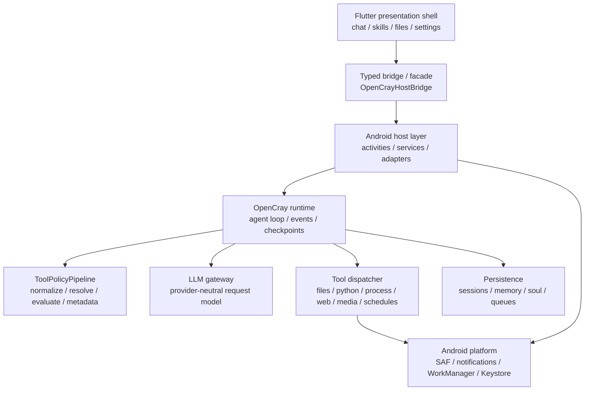

<p align="center">
  <b><a href="README.zh-CN.md">简体中文</a></b>&nbsp;·&nbsp;English
</p>

<div align="center">
  <p>
    
  </p>
  <p><strong>Turn your mobile device into a controllable, auditable, extensible AI Agent workspace.</strong></p>
  <p>
    <a href="#quick-start">Quick Start</a>
    ·
    <a href="#features">Features</a>
    ·
    <a href="#architecture">Architecture</a>
    ·
    <a href="#security-model">Security Model</a>
    ·
    <a href="#development">Development</a>
  </p>
  <p>
    
    
    
    
    
  </p>
</div>

OpenCray is an **Android-first AI agent runtime**. It is not yet another shell that wraps a chat box around a model API. Instead, it brings chat, workspace files, tool calling, approvals, persistence, skill packs, MCP exposure, on-device models, and background tasks into a single **policy-gated, auditable runtime** on mobile.

This repository is currently in a fast-moving **V1** stage. Flutter is the primary presentation layer; Android/Kotlin code provides the host capabilities, runtime services, tool policy, and platform adapters. The root `app/` module remains the key host module; the product entry point now lives in the Android host under `flutter_app/`.

## Features

| Area | Status | Entry point |
| --- | --- | --- |
| Mobile shell | Four main entry points — Chat / Skills / Files / Settings — rendered by Flutter | `flutter_app/lib/features/*` |
| Agent runtime | Session queue, tool loop, run events, approval resume, checkpoint, background-service foundation | `runtime/`, `app/` |
| LLM routing | OpenAI-compatible, Anthropic, LiteLLM proxy, plus on-device LiteRT-LM adapter | `llm/`, `app/*LiteLlm*`, `litertlm_bridge/` |
| Tool system | Files, search, web fetch, commands, Python, media, schedules, subagents, workspace packs | `runtime/src/main/kotlin/com/opencray/runtime/AgentTooling.kt` |
| Policy & approvals | SAFE / AUTO / DEV modes, path resolution, protected files, unified approval metadata pipeline | `policy/`, `runtime/.../policy/` |
| Workspace files | SAF grants, boundary checks, read/write/move/delete, preview, import, share | `filesystem/`, `app/*Workspace*`, `flutter_app/lib/features/files` |
| Skill packs | Built-in skill seeds; install, check, update, delete; local paths and remote sources | `skills/`, `runtime/.../skills/`, `app/src/main/assets/builtin-skills` |
| MCP | Server registration, trust state, auth state, exposure report; remote MCP tool proxy not yet a default V1 capability | `mcp/`, `app/*Mcp*` |
| Memory & personality | Durable memory, soul profile, preference projection, reset boundaries | `runtime/.../memory`, `runtime/.../soul`, `app/*Memory*`, `app/*Soul*` |
| Python runtime | Android p4a embedded Python scaffold with a static dependency whitelist | `python_runner/`, `tools/android_python_runtime_p4a/` |

### Why OpenCray?

- **On-device first.** Runs an agentic chat with local-ish model routing (OpenAI-compatible, Anthropic, LiteLLM, on-device LiteRT-LM) from a phone.
- **Policy-gated tools.** Every tool a model can call flows through `ToolPolicyPipeline` — normalize, resolve targets, evaluate policy, emit unified metadata. Tools aren't granted by name alone.
- **Mobile workspace.** Chat, files, Python, search, web fetch, media, and schedules in one auditable runtime, not a desktop substitute.
- **Privacy-aware local runtime.** Workspace and credentials stay on the device, gated by user approvals.

## Product Map

```text
OpenCray
├─ Chat
│  ├─ Multi-session conversation
│  ├─ Agent run trace, tool calls, approval cards
│  ├─ Attachment import, image / file / voice workflows
│  └─ Background run & notification resume
├─ Skills
│  ├─ Installed skills
│  ├─ Install from local dir / SKILL.md
│  ├─ GitHub / GitLab source checks
│  └─ Built-in skill seeds
├─ Files
│  ├─ Workspace authorization status
│  ├─ Browse, preview, edit, import, share
│  └─ Root-boundary and revoke-authorization recovery
└─ Settings
   ├─ Workspace Access
   ├─ LLM / On-device model
   ├─ MCP
   ├─ API Integrations / Network & Search / Media & Speech
   ├─ Safety & Limits
   ├─ Personalization
   └─ About & Version
```

## Architecture

OpenCray's core layering: Flutter only renders and captures interaction, the Android host owns platform capabilities, and the shared runtime owns agent semantics.



### Module boundaries

| Module | Responsibility |
| --- | --- |
| `flutter_app/` | Flutter product entry and mobile UI: Chat, Skills, Files, Settings |
| `app/` | Android host, Flutter bridge, runtime services, system permissions, notifications, WorkManager, Keystore |
| `runtime/` | Agent loop, tool dispatch, context, memory, soul, subagents, policy-pipeline integration |
| `core/` | Base contracts and session-queue models |
| `policy/` | Execution modes, tool categories, protected paths, and safety decision matrix |
| `filesystem/` | Workspace file operations, batch changes, rollback journal, SAF-grant abstraction |
| `llm/` | Provider-neutral LLM gateway, routing, structured tool-call / final-completion models |
| `skills/` | `SKILL.md` loading, validation, and skill registration |
| `mcp/` | MCP client description, trust / auth / exposure reporting |
| `persistence/` | Session, memory, soul, and other persistence-store contracts |
| `litertlm_bridge/` | LiteRT-LM Android-side bridge |
| `python_runner/` | Python runtime helper entry point |
| `python_tests/` | Python runtime and integration smoke tests |
| `docs/` | Architecture, migration, runtime, release, and UI spec docs |

## Quick Start

### 1. Environment requirements

- Windows is the preferred development environment; the common commands here use `gradlew.bat` and PowerShell scripts.
- Android Studio / Android SDK. The current `app` `compileSdk = 36`, minimum Android 8.0 / API 26.
- JDK 17, or the Android Studio-bundled JBR.
- Flutter SDK, for the `flutter_app/` product entry point.
- Python 3, for `python_tests/` and Python runtime smoke tests.

`local.properties` is machine-specific and should not be committed. It commonly looks like:

```properties
sdk.dir=C:\\Users\\you\\AppData\\Local\\Android\\Sdk
flutter.sdk=D:\\Program Files\\flutter
```

### 2. Clone the project

```powershell
git clone https://github.com/FishBottle7/OpenCray.git
cd OpenCray
```

### 3. Build the Android APK

From the repo root, use the packaging script:

```powershell
.\build-apk.ps1 -Variant debug
```

The artifact is copied to:

```text
build/apk/OpenCray-debug.apk
```

You can also run from the Flutter product entry:

```powershell
cd flutter_app
flutter run -d <device-id>
```

> Note: the root `:app` module no longer represents a standalone full Flutter-product build path. Prefer `build-apk.ps1` for Android artifacts, or the Flutter host under `flutter_app/`.

## Configuration

### LLM

Configure remote models in Settings -> LLM. The current UI strings and host code support:

- OpenAI-compatible endpoint
- Anthropic endpoint
- LiteLLM proxy
- Custom base URL / model / API key

When LLM is disabled or not fully configured, Chat keeps local sessions and setup guidance — it never silently calls a remote provider.

### On-device model

OpenCray already has a LiteRT-LM provider client, model-download, warm-up, and request-routing code. On-device mode prioritizes prompt budget, tool visibility, and warm-start cost, suitable for exploring lightweight skill execution on Android.

### Search, media, and voice

API Integrations / Network & Search / Media & Speech in Settings configure search slots, media generation, and voice services. Model-visible tools in the runtime keep host-level abstractions such as `WebSearch` and `WebFetch`; the concrete connectors are configured and injected at the app layer.

### Python runtime

Android embedded Python uses the p4a scaffold. Default dependencies are pinned by `tools/android_python_runtime_p4a/requirements.lock`, currently:

```text
Pillow, numpy, sympy, requests, networkx, pydicom, simpy,
matplotlib, lxml, pandas, plotly, seaborn, shapely,
openpyxl, XlsxWriter, python-docx, python-pptx
```

V1 does not support dynamic `pip install`, venvs, or downloading dependencies from PyPI inside the app.

## Security Model

OpenCray's tool boundary is centralized in `ToolPolicyPipeline`. Any new tool that crosses filesystem, process, or network boundaries must first enter this pipeline: normalize the tool surface, resolve targets, evaluate policy, and emit unified metadata.

| Mode | Default behavior |
| --- | --- |
| SAFE | Reading files inside the workspace is allowed directly; writes, deletes, commands, and network operations require approval |
| AUTO | Routine reads/writes execute automatically; destructive file operations, commands, and network still require confirmation |
| DEV | Fewer approvals, but does not bypass hard rejections such as protected files and path escape |

Some boundaries to be explicit about:

- Protected paths and path escapes are rejected and cannot be bypassed via DEV mode.
- Rollback only covers local-file checkpoints; commands, network, MCP, and remote-system side effects are not promised to auto-rollback.
- The V1 Termux adapter is an explicitly unavailable stub; production paths do not require Termux.
- MCP currently focuses on exposure state, trust, and auth readiness; remote MCP tool proxying is not a default delivered capability.
- API keys are currently local, developer-oriented settings; manage them per local device security requirements.

## Development

### Common commands

```powershell
.\gradlew.bat test
.\gradlew.bat connectedDebugAndroidTest
python -m pytest
cd flutter_app
flutter test
```

Static check for the Flutter module:

```powershell
dart analyze flutter_app
```

Build a debug APK:

```powershell
.\build-apk.ps1 -Variant debug
```

### Code style

- Kotlin uses 2-space indentation; package names keep the `com.opencray.*` / `org.opencray.*` module convention.
- `PascalCase` for classes, `camelCase` for functions and properties, `UPPER_SNAKE_CASE` for constants.
- Android resource files use lowercase snake case, e.g. `ic_chat_send.xml`.
- UI changes must be checked against `docs/mobile-ui-layout-spec.md`.
- New runtime tools must go through `runtime/src/main/kotlin/com/opencray/runtime/policy/ToolPolicyPipeline.kt`.

### Testing recommendations

| Change type | Preferred verification |
| --- | --- |
| Runtime, policy, tools, persistence | `.\gradlew.bat test`, plus module JVM tests when relevant |
| Android host, permissions, notifications, SAF | `.\gradlew.bat connectedDebugAndroidTest` |
| Flutter UI | `cd flutter_app && flutter test`, and check layout at ~360dp phone width |
| Python runtime | `python -m pytest` |
| APK behavior | `.\build-apk.ps1 -Variant debug`, then install on a device/emulator |

## Documentation index

- [Mobile UI Layout Spec](docs/mobile-ui-layout-spec.md)
- [Flutter UI Migration Architecture](docs/flutter-ui-migration-architecture.md)
- [Agent Runtime Roadmap](docs/agent-runtime-roadmap.md)
- [Runtime Foundation Delivery Plan](docs/runtime-foundation-delivery-plan.md)
- [Tool Policy Pipeline Plan](docs/p3-tool-policy-pipeline-plan.md)
- [Termux Runtime Phase Split](docs/termux-phase.md)
- [Release Checklist](docs/release-checklist.md)
- [Android p4a Python Runtime](tools/android_python_runtime_p4a/README.md)

## Current limitations

OpenCray has a lot of runtime foundation, but it is not yet a complete mobile replacement for every desktop agent capability. These limitations are intentional boundaries:

- V1 does not provide real Termux execution.
- V1 does not promise an iOS client, cloud sync collaboration, or a public marketplace review system.
- Remote MCP tool proxying is not yet open as a default runtime capability.
- Android embedded Python does not do dynamic package installation.

## Contributing

Commit messages follow Conventional Commit. Larger changes in this repository commonly use Chinese summaries, for example:

```text
feat: 重构文件工作台移动端布局
fix: 收口运行时工具策略元数据
docs: 补充 OpenCray 项目 README
```

Pull requests should describe:

- User-visible impact
- Key implementation boundaries
- Verified commands that were run
- Related issues or design documents
- Screenshots or recordings for UI changes

See [CONTRIBUTING](.github/CONTRIBUTING.md) for the full contributor guide.

## License

This project is licensed under the [MIT License](LICENSE).