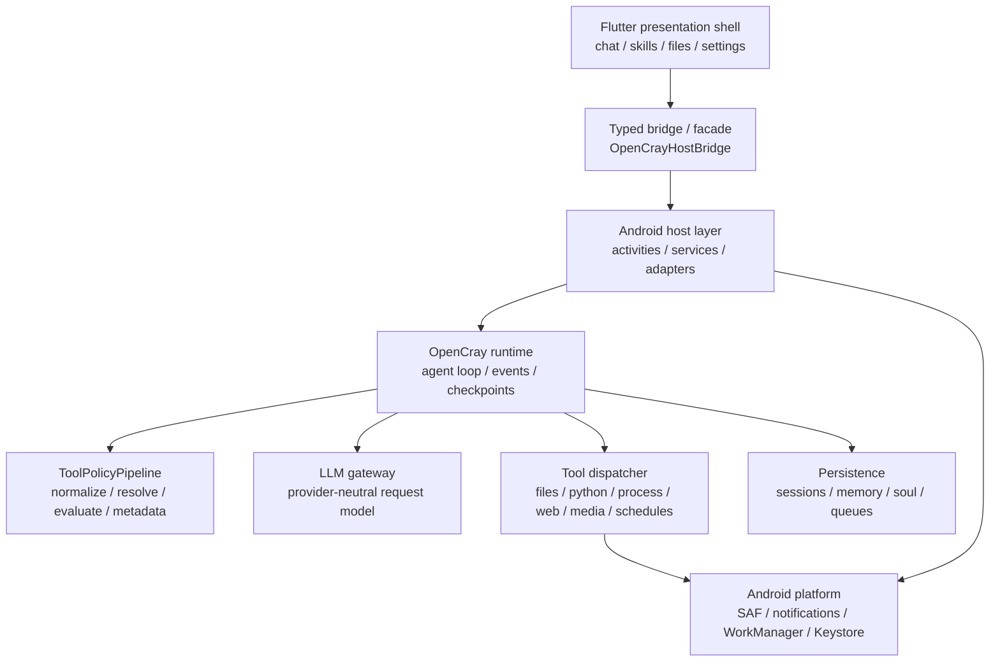

<div align="center">
  <h1>OpenCray</h1>
  <p><strong>把移动设备变成一个可控、可审计、可扩展的 AI Agent 工作台。</strong></p>
  <p>
    <a href="#快速开始">快速开始</a>
    ·
    <a href="#架构">架构</a>
    ·
    <a href="#能力速览">能力速览</a>
    ·
    <a href="#安全模型">安全模型</a>
    ·
    <a href="#开发">开发</a>
  </p>
  <p>
    
    
    
    
    
  </p>
</div>

OpenCray 是一个 Android-first 的 AI Agent 运行时项目。它不是一个只把聊天框套在模型 API 上的外壳，而是在移动端把聊天、工作区文件、工具调用、审批、持久化、技能包、MCP 暴露、端侧模型和后台任务放进同一个受控运行时里。

当前仓库处在快速迭代中的 V1 阶段。Flutter 是主要展示层，Android/Kotlin 代码负责宿主能力、运行时服务、工具策略和平台适配。根目录 `app/` 仍是关键宿主模块；产品入口已迁到 `flutter_app/` 的 Android host。

## 能力速览

| 能力 | 当前状态 | 入口 |
| --- | --- | --- |
| 移动端 Shell | Chat / Skills / Files / Settings 四个主入口，Flutter 负责呈现 | `flutter_app/lib/features/*` |
| Agent Runtime | 会话队列、工具循环、运行事件、审批恢复、checkpoint、后台服务基础 | `runtime/`, `app/` |
| LLM 路由 | OpenAI-compatible、Anthropic、LiteLLM proxy 以及端侧 LiteRT-LM 适配 | `llm/`, `app/*LiteLlm*`, `litertlm_bridge/` |
| 工具系统 | 文件、搜索、网页抓取、命令、Python、媒体、计划任务、子代理、工作区包 | `runtime/src/main/kotlin/com/opencray/runtime/AgentTooling.kt` |
| 策略与审批 | SAFE / AUTO / DEV 模式，路径解析、保护文件、审批元数据统一管线 | `policy/`, `runtime/.../policy/` |
| 工作区文件 | SAF 授权、边界检查、读写移动删除、预览、导入、分享 | `filesystem/`, `app/*Workspace*`, `flutter_app/lib/features/files` |
| 技能包 | 内置技能种子、安装/检查/更新/删除，本地路径和远端来源入口 | `skills/`, `runtime/.../skills/`, `app/src/main/assets/builtin-skills` |
| MCP | 服务器注册、信任状态、认证状态和暴露报告；远端 MCP 工具代理仍未作为 V1 默认能力 | `mcp/`, `app/*Mcp*` |
| 记忆与人格 | durable memory、soul profile、偏好投影、重置边界 | `runtime/.../memory`, `runtime/.../soul`, `app/*Memory*`, `app/*Soul*` |
| Python Runtime | Android p4a 嵌入式 Python scaffold，静态依赖白名单 | `python_runner/`, `tools/android_python_runtime_p4a/` |

## 产品地图

```text
OpenCray
├─ Chat
│  ├─ 多会话对话
│  ├─ Agent 运行轨迹、工具调用、审批卡片
│  ├─ 附件导入、图片/文件/语音工作流
│  └─ 后台运行与通知恢复
├─ Skills
│  ├─ 已安装技能
│  ├─ 本地目录 / SKILL.md 安装
│  ├─ GitHub / GitLab 来源检查
│  └─ 内置技能种子
├─ Files
│  ├─ 工作区授权状态
│  ├─ 文件浏览、预览、编辑、导入、分享
│  └─ 根目录边界和撤销授权恢复
└─ Settings
   ├─ Workspace Access
   ├─ LLM / On-device model
   ├─ MCP
   ├─ API Integrations / Network & Search / Media & Speech
   ├─ Safety & Limits
   ├─ Personalization
   └─ About & Version
```

## 架构

OpenCray 的核心分层是：Flutter 只做展示和交互捕获，Android 宿主负责平台能力，shared runtime 负责 Agent 语义。



### 模块边界

| 模块 | 职责 |
| --- | --- |
| `flutter_app/` | Flutter 产品入口和移动端 UI，包含 Chat、Skills、Files、Settings |
| `app/` | Android 宿主、Flutter bridge、运行时服务、系统权限、通知、WorkManager、Keystore |
| `runtime/` | Agent loop、工具调度、上下文、记忆、soul、subagent、策略管线接入 |
| `core/` | 基础契约和会话队列模型 |
| `policy/` | 执行模式、工具类别、保护路径和安全决策矩阵 |
| `filesystem/` | 工作区文件操作、批量变更、rollback journal、SAF grant 抽象 |
| `llm/` | Provider-neutral LLM gateway、路由、结构化 tool call / final completion 模型 |
| `skills/` | `SKILL.md` 加载、验证和技能注册 |
| `mcp/` | MCP 客户端描述、信任/认证/暴露报告 |
| `persistence/` | 会话、memory、soul 等持久化 store 契约 |
| `litertlm_bridge/` | LiteRT-LM Android 侧桥接 |
| `python_runner/` | Python 运行时辅助入口 |
| `python_tests/` | Python runtime 和集成 smoke tests |
| `docs/` | 架构、迁移、运行时、发布和 UI 规范文档 |

## 快速开始

### 1. 环境要求

- Windows 开发环境优先；仓库里的常用命令以 `gradlew.bat` 和 PowerShell 脚本为主。
- Android Studio / Android SDK，当前 app `compileSdk = 36`，最低 Android 8.0/API 26。
- JDK 17 或 Android Studio 自带 JBR。
- Flutter SDK，用于 `flutter_app/` 产品入口。
- Python 3，用于 `python_tests/` 和 Python runtime smoke tests。

`local.properties` 属于本机配置，不要提交。常见内容如下：

```properties
sdk.dir=C:\\Users\\you\\AppData\\Local\\Android\\Sdk
flutter.sdk=D:\\Program Files\\flutter
```

### 2. 拉取项目

```powershell
git clone https://github.com/FishBottle7/OpenCray.git
cd OpenCray
```

### 3. 构建 Android APK

推荐从仓库根目录使用打包脚本：

```powershell
.\build-apk.ps1 -Variant debug
```

产物会复制到：

```text
build/apk/OpenCray-debug.apk
```

也可以从 Flutter 产品入口运行：

```powershell
cd flutter_app
flutter run -d <device-id>
```

注意：根 `:app` 模块不再单独代表完整 Flutter 产品打包路径。构建 Android artifacts 时优先使用 `build-apk.ps1`，或在 `flutter_app/` 下走 Flutter host。

## 配置

### LLM

在 Settings -> LLM 中配置远端模型。当前 UI 文案和宿主代码支持：

- OpenAI-compatible endpoint
- Anthropic endpoint
- LiteLLM proxy
- 自定义 base URL / model / API key

如果 LLM 未启用或配置不完整，Chat 会保留本地会话和设置引导，不会偷偷调用远端 provider。

### 端侧模型

OpenCray 已有 LiteRT-LM provider client、模型下载、预热和请求路由代码。端侧模式会优先控制 prompt budget、工具可见性和热启动成本，适合在 Android 上探索轻量技能执行。

### 搜索、媒体和语音

Settings 中的 API Integrations / Network & Search / Media & Speech 负责搜索槽位、媒体生成和语音服务配置。运行时里的模型可见工具继续保持 `WebSearch` 和 `WebFetch` 这种宿主抽象，具体连接器由 app 层配置和注入。

### Python runtime

Android 嵌入式 Python 走 p4a scaffold。默认依赖由 `tools/android_python_runtime_p4a/requirements.lock` 固定，当前包括：

```text
Pillow, numpy, sympy, requests, networkx, pydicom, simpy,
matplotlib, lxml, pandas, plotly, seaborn, shapely,
openpyxl, XlsxWriter, python-docx, python-pptx
```

V1 不支持在 app 内动态 `pip install`、venv 或从 PyPI 下载依赖。

## 安全模型

OpenCray 的工具边界集中在 `ToolPolicyPipeline`，新工具如果跨文件系统、进程或网络边界，必须先进入这条管线：规范化工具面、解析目标、执行策略、输出统一 metadata。

| 模式 | 默认行为 |
| --- | --- |
| SAFE | 读工作区内文件可直接放行；写入、删除、命令、网络等风险操作需要审批 |
| AUTO | 常规读写可自动执行；破坏性文件操作、命令和网络仍会要求确认 |
| DEV | 更少审批，但不绕过保护文件、路径逃逸等硬性拒绝 |

几个边界需要明确：

- 保护路径和路径逃逸会被拒绝，不能靠 DEV 模式绕过。
- rollback 只覆盖本地文件 checkpoint；命令、网络、MCP 或远端系统副作用不承诺自动回滚。
- V1 的 Termux adapter 是显式 unavailable stub；生产路径不要求 Termux。
- MCP 当前重点是暴露状态、信任和认证 readiness，远端 MCP 工具代理不是默认交付能力。
- API key 当前属于本机开发者向设置，使用前应按本地设备安全要求管理。

## 开发

### 常用命令

```powershell
.\gradlew.bat test
.\gradlew.bat connectedDebugAndroidTest
python -m pytest
cd flutter_app
flutter test
```

针对 Flutter 模块做静态检查：

```powershell
dart analyze flutter_app
```

构建 debug APK：

```powershell
.\build-apk.ps1 -Variant debug
```

### 代码风格

- Kotlin 使用 2 空格缩进，包名保持 `com.opencray.*` 或 `org.opencray.*` 模块命名约定。
- 类名 `PascalCase`，函数和属性 `camelCase`，常量 `UPPER_SNAKE_CASE`。
- Android 资源文件使用小写 snake case，例如 `ic_chat_send.xml`。
- UI 改动必须对照 `docs/mobile-ui-layout-spec.md`。
- 新运行时工具必须经过 `runtime/src/main/kotlin/com/opencray/runtime/policy/ToolPolicyPipeline.kt`。

### 测试建议

| 改动类型 | 优先验证 |
| --- | --- |
| 运行时、策略、工具、持久化 | `.\gradlew.bat test`，必要时补对应模块 JVM test |
| Android 宿主、权限、通知、SAF | `.\gradlew.bat connectedDebugAndroidTest` |
| Flutter UI | `cd flutter_app && flutter test`，并在 360dp 级手机宽度检查布局 |
| Python runtime | `python -m pytest` |
| APK 行为 | `.\build-apk.ps1 -Variant debug` 后在设备或模拟器上安装 |

## 文档索引

- [移动端 UI 布局规范](docs/mobile-ui-layout-spec.md)
- [Flutter UI 迁移架构](docs/flutter-ui-migration-architecture.md)
- [Agent runtime roadmap](docs/agent-runtime-roadmap.md)
- [Runtime foundation delivery plan](docs/runtime-foundation-delivery-plan.md)
- [Tool policy pipeline plan](docs/p3-tool-policy-pipeline-plan.md)
- [Termux runtime phase split](docs/termux-phase.md)
- [Release checklist](docs/release-checklist.md)
- [Android p4a Python runtime](tools/android_python_runtime_p4a/README.md)

## 当前限制

OpenCray 已经有不少运行时基础，但仍不是“所有桌面 Agent 能力的移动端完整替代品”。这些限制是有意保留的边界：

- V1 不提供真实 Termux 执行。
- V1 不承诺 iOS 客户端、云同步协作或公开 marketplace 审核系统。
- MCP 远端工具代理仍未作为默认 runtime 能力开放。
- Android 嵌入式 Python 不做动态包安装。
- 根目录目前没有声明开源许可证。

## 贡献

提交信息遵循 Conventional Commit。这个仓库里的较大变更通常使用中文摘要，例如：

```text
feat: 重构文件工作台移动端布局
fix: 收口运行时工具策略元数据
docs: 补充 OpenCray 项目 README
```

Pull Request 建议包含：

- 用户可见影响
- 关键实现边界
- 已运行的验证命令
- 相关 issue 或设计文档
- UI 改动的截图或录屏

## License

当前仓库尚未声明开源许可证。使用、分发或商用前，请先联系维护者确认授权边界。
