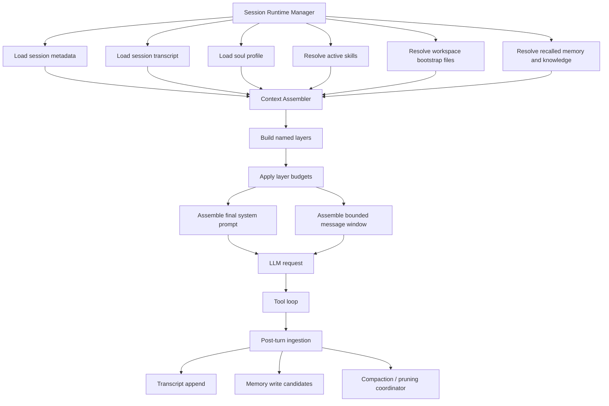
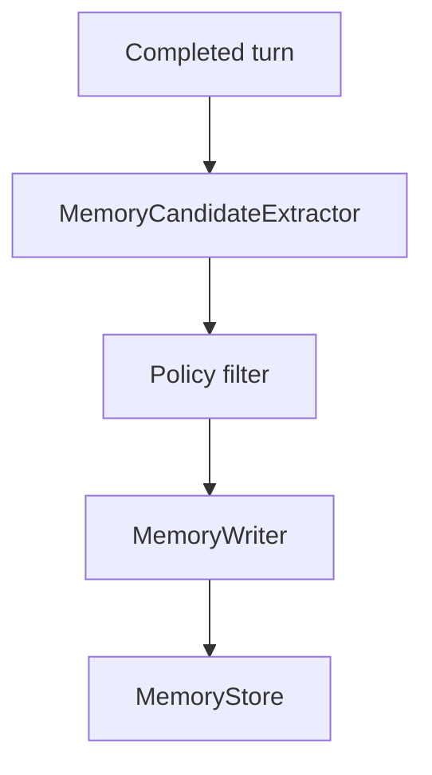
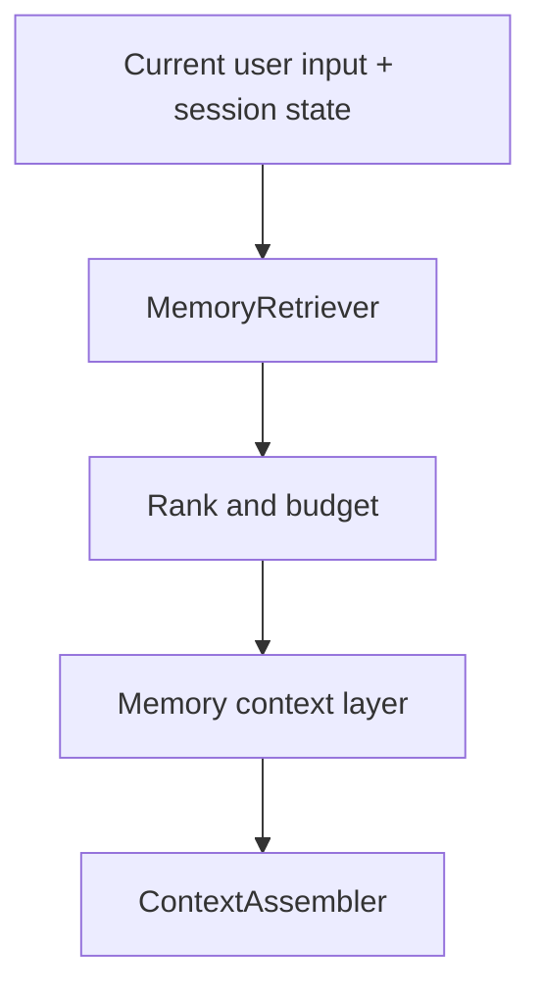
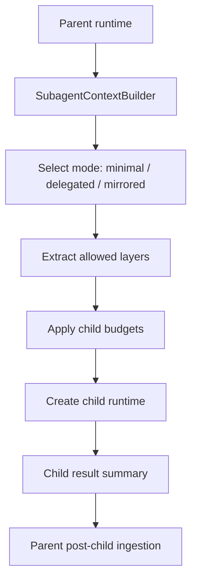
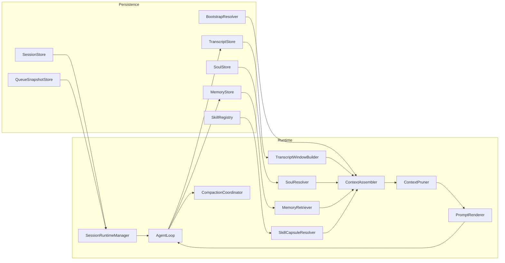

# OpenCray Context Management Design

Last updated: 2026-03-16

## Status

Code-backed architecture design draft

## Purpose

This document defines a production-grade context management design for OpenCray.

It does four things:

1. Describe what OpenCray really does today, based on current code.
2. Explain what is missing for a complete agent-grade context system.
3. Compare OpenCray with two mature reference implementations studied from source code:
   - `D:\codes\Opensource\openclaw`
   - `D:\codes\Opensource\AstrBot`
4. Propose a complete OpenCray-native context architecture, with concrete design patterns, data flow, module boundaries, and implementation guidance.

This document is intentionally deeper than the earlier audit and roadmap documents. It is meant to be the design reference for future runtime work.

## Related documents

- `docs/agent-runtime-audit.md`
- `docs/agent-runtime-task-list.md`
- `docs/agent-runtime-issues.md`
- `docs/agent-runtime-roadmap.md`
- `docs/agent-runtime-reference-guide.md`
- `docs/multi-agent-runtime-design.md`
- `docs/memory-design.md`
- `docs/memory-soul-image-reference-design.md`
- `docs/done/design-p0-live-queue-persistence.md`
- `docs/done/design-p0-session-runtime-manager.md`
- `docs/done/design-p0-prompt-layer-architecture.md`

Multi-agent note:

- `docs/multi-agent-runtime-design.md` supersedes the earlier assumption that base `SOUL.md` lives in the public workspace root
- for the multi-agent rollout, base soul should remain document-based but move into an agent-private root, while public workspace remains tool-visible

## Research Method

This version is based on local code inspection, not only public docs.

### OpenCray code inspected

- `app/src/main/kotlin/com/opencray/app/AppShellActivity.kt`
- `app/src/main/kotlin/com/opencray/app/ChatSessionLocalStore.kt`
- `app/src/main/kotlin/com/opencray/app/PersonalizationLocalStore.kt`
- `app/src/main/kotlin/com/opencray/app/LlmSettingsStore.kt`
- `runtime/src/main/kotlin/com/opencray/runtime/OpenCrayAgentRuntime.kt`
- `runtime/src/main/kotlin/com/opencray/runtime/AgentTooling.kt`
- `core/src/main/kotlin/com/opencray/core/orchestrator/AgentLoop.kt`
- `core/src/main/kotlin/com/opencray/core/orchestrator/SessionQueue.kt`
- `persistence/src/main/kotlin/com/opencray/persistence/model/MemoryRecord.kt`
- `persistence/src/main/kotlin/com/opencray/persistence/model/SoulRecord.kt`
- `skills/src/main/kotlin/com/opencray/skills/SkillLoader.kt`
- `skills/src/main/kotlin/com/opencray/skills/SkillValidator.kt`

### OpenClaw code inspected

Local clone path:

- `D:\codes\Opensource\openclaw`

Primary files examined:

- `src/auto-reply/reply/session.ts`
- `src/auto-reply/reply/agent-runner.ts`
- `src/auto-reply/reply/agent-runner-memory.ts`
- `src/auto-reply/reply/memory-flush.ts`
- `src/config/sessions/types.ts`
- `src/config/sessions/store.ts`
- `src/config/sessions/session-file.ts`
- `src/config/sessions/transcript.ts`
- `src/agents/bootstrap-files.ts`
- `src/agents/system-prompt.ts`
- `src/agents/pi-embedded-runner/system-prompt.ts`
- `src/agents/pi-embedded-runner/run/attempt.ts`
- `src/agents/pi-embedded-runner/compact.ts`
- `src/context-engine/types.ts`
- `src/context-engine/legacy.ts`
- `src/agents/tools/memory-tool.ts`
- `src/agents/skills/workspace.ts`
- `src/agents/pi-extensions/context-pruning/pruner.ts`
- `src/agents/subagent-spawn.ts`
- `src/agents/subagent-registry.ts`
- `src/agents/subagent-announce.ts`
- `src/acp/session.ts`
- `src/acp/translator.ts`

### AstrBot code inspected

Local clone path:

- `D:\codes\Opensource\AstrBot`

Primary files examined:

- `astrbot/core/db/po.py`
- `astrbot/core/conversation_mgr.py`
- `astrbot/core/astr_main_agent.py`
- `astrbot/core/astr_agent_tool_exec.py`
- `astrbot/core/agent/context/manager.py`
- `astrbot/core/agent/context/compressor.py`
- `astrbot/core/agent/context/truncator.py`
- `astrbot/core/agent/runners/tool_loop_agent_runner.py`
- `astrbot/core/skills/skill_manager.py`
- `astrbot/core/astr_main_agent_resources.py`
- `astrbot/core/knowledge_base/kb_mgr.py`
- `astrbot/core/knowledge_base/retrieval/manager.py`
- `astrbot/core/subagent_orchestrator.py`
- `astrbot/core/pipeline/process_stage/method/agent_sub_stages/internal.py`
- `astrbot/core/pipeline/process_stage/method/agent_sub_stages/third_party.py`
- `astrbot/core/agent/runners/dify/dify_agent_runner.py`
- `astrbot/core/agent/runners/coze/coze_agent_runner.py`
- `astrbot/core/agent/runners/dashscope/dashscope_agent_runner.py`
- `astrbot/core/agent/runners/deerflow/deerflow_agent_runner.py`
- `astrbot/builtin_stars/astrbot/long_term_memory.py`

## Terminology

### Context

Everything actually visible to the model during a single run.

Examples:

- system prompt
- current task prompt
- replayed session history
- recalled memory
- injected skill instructions
- tool observations

Context is bounded and ephemeral.

### Memory

Durable information stored outside the current run and later recalled.

Memory is not the same thing as the current transcript.

### Soul

Stable identity and behavioral profile for the agent.

Soul is not a bag of notes. It should shape behavior through structured fields.

### Session

A durable conversational thread with stable identity, transcript history, runtime state, and maintenance lifecycle.

### Skill

A reusable instruction package that may add context, narrow tools, or alter execution strategy.

### Bootstrap files

Agent- or workspace-local files that are injected into startup context or used as structured runtime references.

## Executive Summary

OpenCray currently has a real but minimal request-scoped context loop.

It already has:

- a functioning turn loop in `OpenCrayAgentRuntime`
- a serial session queue abstraction in `SessionQueue`
- local session transcript persistence in `ChatSessionLocalStore`
- local soul and memory persistence primitives
- a skills package loader and validator

It does not yet have a complete context operating model.

What is missing:

- session-scoped runtime ownership
- bounded reconstruction of stored history into runtime context
- explicit named prompt layers
- memory write and recall
- structured soul injection
- runtime-visible executable skill capsules
- context compression and pruning
- workspace bootstrap files
- sub-agent context modes
- context observability and budgeting

### Short conclusion

OpenCray is currently:

- a valid minimal agent loop
- with persistence around the loop
- but without a mature context system connecting those stores back into execution

OpenClaw and AstrBot both solve this with explicit context assembly stages. They differ in style, but they agree on the core pattern:

1. persist durable session history
2. reconstruct a bounded working set before each run
3. inject stable identity layers separately from volatile history
4. treat memory, skills, and subagents as explicit context components
5. apply compression or pruning when the context budget is under pressure

That is the pattern OpenCray still lacks.

## Current OpenCray Context Management

## What OpenCray actually sends today

### System prompt assembly

`AppShellActivity.resolvedAgentSystemPrompt()` builds the runtime system prompt from three pieces:

- base prompt from `LlmSettingsState.systemPrompt` or `OpenCrayAgentRuntimeConfig.DEFAULT_OPENCRAY_SYSTEM_PROMPT`
- session policy text from `ChatSessionLocalStore.DEFAULT_SYSTEM_TEMPLATE_ID`
- personalization overlay from the current soul-like summary

Code evidence:

- `app/src/main/kotlin/com/opencray/app/AppShellActivity.kt:1172-1188`
- `app/src/main/kotlin/com/opencray/app/ChatSessionLocalStore.kt:493-496`

This is already a layered prompt in spirit, but it is not modeled as explicit runtime layers. It is still plain string concatenation in the activity.

### Turn prompt assembly

`OpenCrayAgentRuntime.renderPrompt()` builds the user-visible runtime prompt from:

- protocol instructions
- JSON output schema examples
- tool definitions
- task metadata
- current in-memory transcript

Code evidence:

- `runtime/src/main/kotlin/com/opencray/runtime/OpenCrayAgentRuntime.kt:253-282`

### Runtime transcript scope

`OpenCrayAgentRuntime.executePromptTask()` starts every run with exactly one transcript entry:

- current user input

Then it appends:

- assistant tool call markers
- tool observations

Code evidence:

- `runtime/src/main/kotlin/com/opencray/runtime/OpenCrayAgentRuntime.kt:66-75`
- `runtime/src/main/kotlin/com/opencray/runtime/OpenCrayAgentRuntime.kt:134-148`

This means OpenCray has a real thought-action-observation loop, but it is bounded to the current request.

## What OpenCray persists today but does not feed back correctly

### Chat session transcript

`ChatSessionLocalStore` persists sessions and messages, including a seeded system message template.

Code evidence:

- `app/src/main/kotlin/com/opencray/app/ChatSessionLocalStore.kt:342-370`
- `app/src/main/kotlin/com/opencray/app/ChatSessionLocalStore.kt:373-380`

However, the stored conversation is not reconstructed into runtime prompt context before a new run starts.

### Soul and memory

`PersonalizationLocalStore` uses real soul and memory stores, but current runtime usage is limited to flattening soul-like preferences into one summary block. Memory records are not part of runtime behavior.

### Skills

`OpenCrayToolDispatcher` exposes `skills_list` and `skill_read`, but the Android live path does not pass app-managed skill roots into runtime.

Code evidence:

- `runtime/src/main/kotlin/com/opencray/runtime/AgentTooling.kt:119-129`
- `runtime/src/main/kotlin/com/opencray/runtime/AgentTooling.kt:205-214`
- `runtime/src/main/kotlin/com/opencray/runtime/AgentTooling.kt:487-492`

### Queue state

The live Android path still creates a fresh loop per prompt and uses `InMemorySessionQueueSnapshotStore`.

Code evidence:

- `app/src/main/kotlin/com/opencray/app/AppShellActivity.kt:1033-1037`

That is a major reason OpenCray still behaves like a per-request agent instead of a session runtime.

## Current OpenCray architectural reality

The current context model is:

```text
stored chat history  ----\
stored soul summary   ----+--> Activity builds one systemPrompt string
user settings         ----/

current user input --> OpenCrayAgentRuntime
                     -> per-run transcript starts from current input
                     -> tool calls/results accumulate in memory
                     -> final answer returned

stored memory, stored skills, stored transcript
exist beside runtime but do not actively shape execution
```

This is the central design problem.

## Current OpenCray weaknesses

### 1. Context is request-scoped, not session-scoped

Each send action creates a fresh runtime and fresh loop.

Impact:

- shallow continuity
- no stable per-session runtime owner
- no recoverable in-flight state

### 2. Stored transcript and runtime transcript are separate systems

The app stores chat history for UI and editing, but runtime history begins from the new user turn.

Impact:

- weak conversational continuity
- no bounded replay policy
- no place to add compaction later

### 3. Soul is flattened too early

Soul is rendered as one descriptive paragraph before runtime sees it.

Impact:

- no structured persona boundaries
- no mapping from soul to tool policy, verbosity, escalation, or tone

### 4. Memory is storage-only

Memory persistence exists, but runtime never recalls it and production flows do not write it intentionally.

Impact:

- storage without intelligence

### 5. Skills are metadata, not execution context

OpenCray can validate and read skills, but not attach them as instruction capsules, filtered toolsets, or sub-runtimes.

### 6. No context pressure management

There is no:

- transcript windowing
- compaction summary
- tool-result pruning
- token budgeting by layer

### 7. No context trace

OpenCray cannot answer:

- what exact context was assembled for this run
- how many tokens each layer consumed
- why a message was pruned or omitted

## Mature Patterns Observed in OpenClaw and AstrBot

## OpenClaw: code-backed patterns

OpenClaw is the cleaner reference for a full context pipeline.

### Pattern A: session metadata and transcript are deliberately split

OpenClaw persists session metadata in `sessions.json` and turn-by-turn transcript in per-session `.jsonl` files.

Observed data split:

- `SessionEntry` stores metadata such as:
  - `sessionId`
  - `sessionFile`
  - `updatedAt`
  - `compactionCount`
  - `memoryFlushAt`
  - `skillsSnapshot`
  - `systemPromptReport`
  - subagent lineage and ACP metadata
- actual conversational turns live in `agents/<agentId>/sessions/<sessionId>.jsonl`

Code evidence:

- `D:\codes\Opensource\openclaw\src\config\sessions\types.ts`
- `D:\codes\Opensource\openclaw\src\config\sessions\store.ts`
- `D:\codes\Opensource\openclaw\src\config\sessions\session-file.ts`
- `D:\codes\Opensource\openclaw\src\config\sessions\transcript.ts`

Important lesson for OpenCray:

- transcript history and runtime/session control state should not be forced into one storage shape

### Pattern B: session resolution happens before runtime assembly

`initSessionState()` resolves or creates the session, chooses the transcript path, and handles reset or archival behavior before the runtime even begins assembling the prompt.

Code evidence:

- `D:\codes\Opensource\openclaw\src\auto-reply\reply\session.ts`

Important lesson:

- session identity is not a UI concern
- it is part of runtime context initialization

### Pattern C: bootstrap files are a first-class input source

`resolveBootstrapContextForRun()` loads workspace bootstrap files, filters them by session mode, allows hooks to mutate them, and then converts them into injected context files.

Code evidence:

- `D:\codes\Opensource\openclaw\src\agents\bootstrap-files.ts`

Key behavior:

- bootstrap file discovery
- context mode filtering such as `full` vs `lightweight`
- future live-context suppression profiles such as `no_soul` and `no_memory_or_soul`
- hook override stage before final injection
- per-file and total character budgets

This is not a prompt string hack. It is a pipeline stage.

### Pattern D: system prompt assembly is explicit and sectioned

`buildEmbeddedSystemPrompt()` delegates to `buildAgentSystemPrompt()`, which composes stable sections such as:

- skills guidance
- memory recall guidance
- time and runtime info
- documentation references
- messaging guidance
- context files

Code evidence:

- `D:\codes\Opensource\openclaw\src\agents\pi-embedded-runner\system-prompt.ts`
- `D:\codes\Opensource\openclaw\src\agents\system-prompt.ts:20-187`

Important implication:

- stable prompt sections are not fused with volatile conversation history
- subagents can request `PromptMode = minimal`
- the system prompt is a structured product, not a blob

### Pattern E: context assembly is its own lifecycle stage

In `run/attempt.ts`, OpenClaw assembles runtime state in ordered phases:

1. resolve skills prompt
2. resolve bootstrap context
3. build embedded system prompt
4. prepare session manager and compaction safeguards
5. let the context engine assemble a bounded message set
6. let the context engine add system prompt additions
7. after the turn, let the context engine ingest and compact

Code evidence:

- `D:\codes\Opensource\openclaw\src\agents\pi-embedded-runner\run\attempt.ts:1072-1109`
- `D:\codes\Opensource\openclaw\src\agents\pi-embedded-runner\run\attempt.ts:1279-1309`
- `D:\codes\Opensource\openclaw\src\agents\pi-embedded-runner\run\attempt.ts:1377-1404`
- `D:\codes\Opensource\openclaw\src\agents\pi-embedded-runner\run\attempt.ts:1712-1731`
- `D:\codes\Opensource\openclaw\src\agents\pi-embedded-runner\run\attempt.ts:2193-2233`

This is the most important pattern OpenCray should borrow.

### Pattern F: context management is pluggable

OpenClaw exposes a `ContextEngine` interface with lifecycle methods:

- `bootstrap`
- `ingest`
- `ingestBatch`
- `assemble`
- `compact`
- `afterTurn`
- `prepareSubagentSpawn`
- `onSubagentEnded`

Code evidence:

- `D:\codes\Opensource\openclaw\src\context-engine\types.ts`

This is a mature design because:

- context is treated as a subsystem, not buried inside the runner
- compaction is not special-cased string logic
- subagent context behavior has a formal contract

### Pattern G: memory affects runtime in three different ways

OpenClaw memory is not one feature. It has three runtime paths:

1. memory recall tools during the run:
   - `memory_search`
   - `memory_get`
2. plugin-backed durable memory extensions
3. automatic pre-compaction memory flush runs

Code evidence:

- `D:\codes\Opensource\openclaw\src\agents\tools\memory-tool.ts`
- `D:\codes\Opensource\openclaw\src\auto-reply\reply\agent-runner-memory.ts`
- `D:\codes\Opensource\openclaw\src\auto-reply\reply\memory-flush.ts`
- `D:\codes\Opensource\openclaw\src\agents\system-prompt.ts:38-63`

Important design choice:

- long-term memory is not blindly injected every turn
- memory is recalled on demand and flushed intentionally before compaction pressure

### Pattern H: skills affect prompt assembly and session metadata

Skills in OpenClaw are resolved into a skill prompt fragment and a `skillsSnapshot` stored on the session entry.

Code evidence:

- `D:\codes\Opensource\openclaw\src\agents\skills\workspace.ts`
- `D:\codes\Opensource\openclaw\src\config\sessions\types.ts`

Important lesson:

- the runtime should know which skills were visible for that run

### Pattern I: subagents get their own session lineage and bounded context

OpenClaw subagents receive:

- their own session key
- their own transcript file
- spawn lineage metadata
- reduced bootstrap injection
- subagent-specific prompt mode and control scope

Code evidence:

- `D:\codes\Opensource\openclaw\src\agents\subagent-spawn.ts`
- `D:\codes\Opensource\openclaw\src\agents\subagent-registry.ts`
- `D:\codes\Opensource\openclaw\src\agents\subagent-announce.ts`
- `D:\codes\Opensource\openclaw\src\context-engine\types.ts:123-144`

This is the correct model for subagents:

- child runs should not inherit the full parent context by default
- context transfer must be explicit and bounded

### Pattern J: pruning and compaction are separate

OpenClaw distinguishes:

- prompt-time pruning of context payload
- compaction of session history into summaries or reduced form
- store-level pruning and transcript archival for old sessions

Code evidence:

- `D:\codes\Opensource\openclaw\src\agents\pi-extensions\context-pruning\pruner.ts`
- `D:\codes\Opensource\openclaw\src\agents\pi-embedded-runner\compact.ts`
- `D:\codes\Opensource\openclaw\src\config\sessions\store.ts`

That separation matters. Pruning is temporary and prompt-local. Compaction is durable and session-level. Store pruning is retention management.

## AstrBot: code-backed patterns

AstrBot is less unified than OpenClaw, but still shows several mature patterns that OpenCray can reuse.

### Pattern A: local session identity and local conversation history are separate

AstrBot uses:

- `event.unified_msg_origin` as session identity
- `sel_conv_id` in preferences to map session to active conversation
- `ConversationV2.content` in DB as the authoritative local message history

Code evidence:

- `D:\codes\Opensource\AstrBot\astrbot\core\db\po.py`
- `D:\codes\Opensource\AstrBot\astrbot\core\conversation_mgr.py`
- `D:\codes\Opensource\AstrBot\astrbot\core\utils\shared_preferences.py`

Important lesson:

- session and transcript are related but not identical concerns

### Pattern B: conversation history is reconstructed before the run

AstrBot retrieves the current conversation and assigns `req.contexts = json.loads(conversation.history)`.

Code evidence:

- `D:\codes\Opensource\AstrBot\astrbot\core\astr_main_agent.py:1117-1119`
- `D:\codes\Opensource\AstrBot\astrbot\core\conversation_mgr.py`

This is the simplest pattern OpenCray still lacks.

### Pattern C: system prompt assembly happens in multiple feature stages

AstrBot mutates `req.system_prompt` through several explicit steps:

- prompt prefix
- persona instructions
- persona begin dialogs
- skills prompt
- knowledge base hints or knowledge-base tool injection
- safety prompt
- local or sandbox runtime prompts
- tool-call protocol prompt
- live-mode prompt

Code evidence:

- `D:\codes\Opensource\AstrBot\astrbot\core\astr_main_agent.py:301-355`
- `D:\codes\Opensource\AstrBot\astrbot\core\astr_main_agent.py:630-662`
- `D:\codes\Opensource\AstrBot\astrbot\core\astr_main_agent.py:1138-1205`

AstrBot is still string-based, but it at least has explicit feature stages.

### Pattern D: current user input is appended after historical contexts are loaded

In AstrBot, the final in-memory runner context is:

- stored `req.contexts`
- current user message from `ProviderRequest.assemble_context()`
- one prepended system message from `req.system_prompt`

Code evidence:

- `D:\codes\Opensource\AstrBot\astrbot\core\astr_main_agent.py`
- `D:\codes\Opensource\AstrBot\astrbot\core\provider\entities.py`
- `D:\codes\Opensource\AstrBot\astrbot\core\agent\runners\tool_loop_agent_runner.py`

Important lesson:

- persisted history and current input are assembled deliberately, not conflated at storage time

### Pattern E: context compression is owned by a dedicated component

AstrBot has a `ContextManager` that applies:

1. max-turn truncation
2. token-based compression
3. fallback halving truncation if compression is still too large

Code evidence:

- `D:\codes\Opensource\AstrBot\astrbot\core\agent\context\manager.py`
- `D:\codes\Opensource\AstrBot\astrbot\core\agent\runners\tool_loop_agent_runner.py:126-138`
- `D:\codes\Opensource\AstrBot\astrbot\core\agent\runners\tool_loop_agent_runner.py:366-372`

Important implication:

- context budgeting lives below the high-level agent builder
- the runner always processes context before LLM invocation

### Pattern F: compression becomes durable only when history is saved back

AstrBot compresses in-memory runner context first, then persists the mutated result back into conversation history through `_save_to_history()`.

Code evidence:

- `D:\codes\Opensource\AstrBot\astrbot\core\pipeline\process_stage\method\agent_sub_stages\internal.py`
- `D:\codes\Opensource\AstrBot\astrbot\core\agent\context\compressor.py`
- `D:\codes\Opensource\AstrBot\astrbot\core\agent\context\truncator.py`

Important lesson:

- compression policy and persistence policy should be separate decisions

### Pattern G: skills are injected as prompt inventory, not hidden implementation detail

AstrBot explicitly builds a skills section that tells the model:

- available skills
- where the corresponding `SKILL.md` lives
- that it must read the file before using the skill
- progressive disclosure rules

Code evidence:

- `D:\codes\Opensource\AstrBot\astrbot\core\skills\skill_manager.py:138-210`
- `D:\codes\Opensource\AstrBot\astrbot\core\skills\skill_manager.py:299-370`

This is very close to what OpenCray should do in its first skill-runtime phase.

### Pattern H: personas alter both system prompt and context prefix

AstrBot personas can:

- prepend persona prompt into `system_prompt`
- inject `begin_dialogs` into `req.contexts`
- filter available skills
- filter or widen available tools

Code evidence:

- `D:\codes\Opensource\AstrBot\astrbot\core\astr_main_agent.py:327-370`

This is the right general lesson for OpenCray soul design:

- stable personality is not only text
- it can shape context and capability selection

### Pattern I: subagents are bounded runtimes with dedicated handoff context

AstrBot handoff execution constructs a reduced child runtime with:

- subagent-specific system prompt
- optional `begin_dialogs`
- dedicated toolset
- dedicated provider override

Code evidence:

- `D:\codes\Opensource\AstrBot\astrbot\core\astr_agent_tool_exec.py:266-307`

AstrBot also has a wake-back pattern for background subagent completion, where the parent session is re-entered with a compact summary of the background result.

Code evidence:

- `D:\codes\Opensource\AstrBot\astrbot\core\astr_agent_tool_exec.py:388-399`
- `D:\codes\Opensource\AstrBot\astrbot\core\astr_agent_tool_exec.py:490-520`

### Pattern J: knowledge and long-term memory are feature-level injections

AstrBot supports:

- knowledge-base retrieval into `system_prompt`
- knowledge-base query tool injection
- a built-in "long-term memory" feature that is actually plugin-scoped in-memory chat memory

Code evidence:

- `D:\codes\Opensource\AstrBot\astrbot\core\astr_main_agent_resources.py`
- `D:\codes\Opensource\AstrBot\astrbot\core\knowledge_base\kb_mgr.py`
- `D:\codes\Opensource\AstrBot\astrbot\builtin_stars\astrbot\long_term_memory.py`

Important lesson:

- recalled knowledge must enter runtime explicitly
- but not every memory-like feature belongs in the durable core transcript model

### Pattern K: there are two context architectures in AstrBot

AstrBot's internal runner path is the real local context architecture:

- `ConversationManager`
- `ConversationV2.content`
- `build_main_agent()`
- `ToolLoopAgentRunner`
- `_save_to_history()`

Third-party runners such as Dify, Coze, DashScope, and DeerFlow mostly delegate continuity to remote thread or conversation ids.

Code evidence:

- `D:\codes\Opensource\AstrBot\astrbot\core\pipeline\process_stage\method\agent_sub_stages\internal.py`
- `D:\codes\Opensource\AstrBot\astrbot\core\pipeline\process_stage\method\agent_sub_stages\third_party.py`
- `D:\codes\Opensource\AstrBot\astrbot\core\agent\runners\dify\dify_agent_runner.py`
- `D:\codes\Opensource\AstrBot\astrbot\core\agent\runners\coze\coze_agent_runner.py`
- `D:\codes\Opensource\AstrBot\astrbot\core\agent\runners\dashscope\dashscope_agent_runner.py`
- `D:\codes\Opensource\AstrBot\astrbot\core\agent\runners\deerflow\deerflow_agent_runner.py`

Important lesson for OpenCray:

- do not let external-provider continuity hide the need for a local context architecture

## OpenCray versus mature references

## What OpenCray already has

- a usable core loop
- a serial queue abstraction
- a local transcript store
- basic soul and memory stores
- skills parsing and validation
- tool dispatcher with workspace safety boundaries

## What OpenCray lacks relative to OpenClaw

| Area | OpenCray today | OpenClaw pattern |
| --- | --- | --- |
| Session runtime ownership | One loop per prompt | One durable session runtime + session files |
| History reconstruction | No bounded replay | Session-backed message reconstruction |
| Prompt assembly | Activity string concatenation | Sectioned prompt builder |
| Bootstrap files | None | Formal bootstrap resolution pipeline |
| Context lifecycle | In runtime class only | Dedicated context engine lifecycle |
| Memory recall | None | Memory tools + prompt guidance + pre-compaction flush |
| Compaction | None | Durable compaction lifecycle |
| Pruning | None | Prompt-time pruning extensions |
| Subagent context | None | Minimal prompt modes + spawn lifecycle hooks |
| Session metadata richness | Minimal | `systemPromptReport`, `skillsSnapshot`, `compactionCount`, lineage |
| Context trace | Minimal | Explicit prompt/context reporting |

## What OpenCray lacks relative to AstrBot

| Area | OpenCray today | AstrBot pattern |
| --- | --- | --- |
| Stored history replay | No | `req.contexts = conversation.history` |
| Persona layering | Flattened summary | Prompt + begin dialogs + tool filtering |
| Skills visibility | Read-only tool path | Skill inventory prompt + runtime selection |
| Context compression | None | `ContextManager` before LLM call |
| Knowledge injection | None | KB injection or KB tool |
| Subagent handoff | None | Dedicated handoff runtimes |
| Local versus remote continuity | Not separated | Internal runner and third-party runner separated explicitly |

## The key architectural gap

The difference is not that OpenCray lacks "more prompt text".

The real difference is that OpenClaw and AstrBot both have a context assembly pipeline, while OpenCray still has scattered context fragments.

## Design goals for OpenCray

OpenCray should adopt the following goals.

### Goal 1: session-first runtime

The unit of context ownership must be the chat session, not the individual prompt.

### Goal 2: explicit context layers

Every contribution to runtime context must have a name, source, budget, and traceability.

### Goal 3: distinct durable stores versus ephemeral working set

OpenCray must separate:

- what is stored durably
- what is selected into the next run

### Goal 4: progressive disclosure for memory and skills

Do not inject everything every turn. Retrieve or activate only what is relevant.

### Goal 5: bounded child context

Subagents should inherit a purpose-built capsule, not the entire parent prompt.

### Goal 6: compaction before crisis

OpenCray must manage budget pressure proactively instead of waiting for context window failures.

Important refinement:

- OpenCray should not make Codex-style global compression its default architecture
- OpenCray should keep layered context ownership and layer-local reducers
- OpenCray should add one model-aware global budget coordinator above those reducers

That means:

- local pruning, transcript windowing, working-state caps, memory caps, bootstrap caps, and skill caps still matter
- but one runtime-level allocator must decide which layers keep space under total prompt pressure

Related designs:

- `docs/working-state-layer-design.md`
- `docs/global-context-budget-coordination-design.md`

### Goal 7: observable assembly

Every run should be inspectable after the fact.

## Proposed OpenCray Target Architecture

## Source-of-truth stores

OpenCray should formalize seven persistent or semi-persistent sources.

1. Session metadata store
2. Session transcript store
3. Session queue state store
4. Soul source-of-truth
5. Memory store
6. Skills registry and installed skill roots
7. Workspace bootstrap source

### Proposed ownership

```text
Session metadata store
  owns:
  - session id
  - active model / mode / config overrides
  - compaction summary pointers
  - runtime status

Session transcript store
  owns:
  - ordered turns
  - tool calls
  - tool observations
  - edit lineage if needed

Session queue store
  owns:
  - in-flight task ids
  - pending / running / cancelled states
  - restart recovery metadata

Soul source-of-truth
  owns:
  - durable base persona in `SOUL.md`
  - the preset-selected template used to seed the initial `SOUL.md`
  - admin- or creator-level updates that intentionally rewrite `SOUL.md`

Memory store
  owns:
  - durable facts
  - preferences
  - project notes
  - tasks / commitments
  - relationship or persona-evolution memories that should influence behavior without silently rewriting `SOUL.md`

Skills registry
  owns:
  - installed skills
  - enable/disable state
  - metadata
  - tool policy

Workspace bootstrap source
  owns:
  - agent-local files like AGENTS.md / SOUL.md / TOOLS.md / PROJECT.md
```

## Runtime context layers

OpenCray should assemble context in explicit layers.

### Layer 1: runtime identity and core policy

Source:

- baked-in OpenCray base prompt
- provider/runtime invariants
- non-negotiable safety invariants

Role:

- define the agent's operating contract

### Layer 2: soul profile

Source:

- `SOUL.md` parsed into typed runtime form
- relationship or persona-evolution overlays from memory
- session-local role overlays for the current run only

Role:

- stable base persona identity
- tone
- defaults
- escalation style
- verbosity bias
- collaboration style

### Layer 3: session directives

Source:

- session policy template
- per-session settings
- chat mode
- current model and tool policy

Role:

- describe how this session differs from defaults

### Layer 4: session working state

Source:

- compact operational projection of the active task or run
- recent findings, actions, branch decisions, blockers, and next actions

Role:

- short-term procedural continuity
- preserve what the agent is doing now
- survive transcript pressure better than raw replay alone

Important boundary:

- this layer should not be treated as only a bounded transcript reconstruction
- transcript replay and working state should be separate layers with different compaction rules

### Layer 5: bounded session transcript

Source:

- bounded reconstruction of recent transcript
- optional compaction summaries where needed

Role:

- conversational continuity
- provenance and recent replay

### Layer 6: retrieved durable context

Source:

- memory recall
- knowledge retrieval
- project bootstrap snippets when required

Role:

- durable continuity
- externalized recall

### Layer 7: skill and execution capsules

Source:

- selected skill inventory
- activated skill instructions
- subagent capsules

Role:

- give the model the correct execution playbook for the current task

### Layer 8: task protocol

Source:

- current user input
- runtime action protocol
- tool schema

Role:

- immediate step decision making

## Full assembly pipeline



## OpenCray target data flow per turn

```text
user sends message
  -> SessionRuntimeManager(sessionId)
  -> load session state
  -> resolve short-term working state
  -> reconstruct bounded working transcript
  -> resolve soul layer
  -> resolve session policy layer
  -> resolve bootstrap snippets
  -> resolve memory recall
  -> resolve skill inventory / active skill capsule
  -> assemble prompt layers + message window
  -> run tool loop
  -> append assistant/tool turns to transcript
  -> evaluate memory writes
  -> evaluate compaction/pruning
  -> persist updated session snapshot
```

## Proposed design patterns

## Pattern 1: Session Runtime Manager

OpenCray needs one runtime owner per active session.

Responsibilities:

- receive user submit/cancel/retry/resume
- own `AgentLoop`
- own queue store binding
- own context assembly requests
- own event fan-out to UI
- own restart recovery

Suggested module:

- `runtime/src/main/kotlin/com/opencray/runtime/session/SessionRuntimeManager.kt`

Without this, context will remain fragmented across activity lifecycle and transient loops.

## Pattern 2: Context Assembler

This should be the equivalent of OpenClaw's prompt plus context-engine assembly stages.

Responsibilities:

- accept a `ContextAssemblyRequest`
- resolve all layers
- produce:
  - `systemPrompt`
  - `messageWindow`
  - `contextReport`

Suggested module:

- `runtime/src/main/kotlin/com/opencray/runtime/context/ContextAssembler.kt`

Suggested outputs:

```kotlin
data class AssembledContext(
  val systemPrompt: String,
  val messages: List<RuntimeMessage>,
  val report: ContextAssemblyReport,
)
```

## Pattern 3: Global Context Budget Coordinator

OpenCray should add one model-aware coordinator above all layer-local reducers.

Responsibilities:

- compute the total input budget for the current model and route
- classify layers by retention priority
- apply a global reduction order after local layer caps have already run
- preserve identity and working state longer than replay and archive layers
- choose when stronger replay compaction or provider-native continuation is worth using
- emit a structured per-run budget report

Suggested modules:

- `runtime/src/main/kotlin/com/opencray/runtime/context/ModelContextBudgetPolicy.kt`
- `runtime/src/main/kotlin/com/opencray/runtime/context/GlobalContextBudgetCoordinator.kt`

Important boundary:

- this is not the same thing as making generic global compression the default
- transcript compaction remains one reduction operator inside the larger budget strategy

Related design:

- `docs/global-context-budget-coordination-design.md`

## Pattern 4: Transcript Window Builder

This component rebuilds the in-run message window from persisted history.

Responsibilities:

- load session transcript
- preserve recent turns
- inject compaction summaries if present
- drop or collapse oversized tool results
- output a bounded working set

Suggested module:

- `runtime/src/main/kotlin/com/opencray/runtime/history/TranscriptWindowBuilder.kt`

This is the minimal feature OpenCray must add first.

## Pattern 5: Structured Soul Resolver

Soul should become typed runtime data.

Suggested fields:

- `tone`
- `verbosity`
- `userRelationshipStyle`
- `riskTolerance`
- `toolUseBias`
- `escalationRules`
- `forbiddenBehaviors`
- `collaborationPreferences`

Suggested modules:

- `runtime/src/main/kotlin/com/opencray/runtime/soul/SoulProfile.kt`
- `runtime/src/main/kotlin/com/opencray/runtime/soul/SoulProfileResolver.kt`
- `runtime/src/main/kotlin/com/opencray/runtime/soul/SoulPromptRenderer.kt`

### Source-of-truth rule

OpenCray should not keep two independent durable persona authorities.

The durable base persona source should be `SOUL.md`.

After agent creation, end users should not be able to directly rewrite core persona by simply asking for a personality change in normal conversation.

`typed soul` should remain, but only as a runtime-normalized representation used to:

- parse and validate the currently effective persona
- merge overlays deterministically
- test field precedence
- render prompt sections and debug trace consistently

It should not become a second long-lived soul store that can drift away from `SOUL.md`.

### Recommended layering

```text
preset chosen at agent creation
  -> seeds initial SOUL.md

SOUL.md
  -> base persona source of truth
  -> stable core identity that should not be casually rewritten by chat turns

relationship / persona-evolution memory
  -> durable user/workspace/session-scoped behavior drift
  -> does not rewrite SOUL.md
  -> only influences relationship-facing adaptive traits

session overlay
  -> current-run acting mode only

runtime normalized soul
  -> ephemeral merged result used for prompt assembly
```

### Why this layering matters

This keeps three different things separate:

- who the agent fundamentally is
- how the relationship with a specific user has evolved over time
- how the agent should behave in this one run

Without that separation, OpenCray will either:

- overwrite base persona too aggressively, or
- lose the gradual "character evolution" that some users actively want

### Do not collapse preference and relationship

OpenCray should explicitly separate two different things that are easy to confuse:

1. what the user is asking for
2. what the relationship has actually become

Those are not the same.

If a user says:

- "Be gentler with me."
- "Talk to me more softly from now on."
- "I want you to sound more affectionate."

that is first and foremost a preference signal.

It means:

- the user prefers a certain interaction style
- the runtime may adapt style within allowed bounds
- the system may remember that preference durably

It does **not** automatically mean:

- trust has increased
- intimacy has increased
- emotional attachment has formed
- romantic-coded affection should suddenly appear

Repeated explicit requests or declarations should not be enough, by themselves, to produce deep relationship changes. A human relationship does not become emotionally intimate just because a sentence was repeated several times. OpenCray should follow the same principle.

### Two-layer relationship model

To stay believable, relationship-facing evolution should be split into two layers.

#### Layer A: interaction preference layer

This layer captures how the user wants the agent to behave toward them.

Examples:

- preferred warmth level
- preferred formality level
- preferred address style
- whether a softer or more direct speaking style is preferred

This layer may be influenced by explicit user instructions.

Examples:

- "Call me this nickname."
- "Be a bit gentler with me."
- "Don't be so formal with me."

This layer is still bounded by:

- the core soul
- protected-field rules
- plasticity
- current session constraints

It should be understood as "preferred interaction style", not "actual emotional bond".

#### Layer B: relationship state layer

This layer captures what the relationship has actually grown into through lived interaction history.

This is where OpenCray should eventually model things like:

- familiarity
- trust
- safety
- intimacy permission
- playfulness permission
- affection tendency
- reciprocity / mutual confirmation

This layer should **not** primarily move because the user requested it directly.

It should move mainly because the interaction history justifies it.

That difference is essential.

If OpenCray skips this split and uses one shared "relationship score", it will drift into implausible behavior:

- repeated requests will look like instant emotional progress
- style preference will be mistaken for attachment
- the agent will appear easy to manipulate rather than relationally believable

### Core rule: no direct personality rewrite by request

The following should be treated as invalid as direct soul rewrites in ordinary chat:

- "Change your personality to be completely different from now on."
- "Rewrite your soul so you are no longer serious."
- "Your core persona is now submissive/playful/cold."

Those requests may still affect:

- session overlay for the current run
- relationship evolution signals for adaptive traits

But they should not directly mutate `SOUL.md` or the base soul record.

If OpenCray later supports true soul editing, it should be a separate creator/admin flow, not a normal in-chat instruction path.

### Examples

- "This time be more serious."  
  -> session overlay

- "Only with me, be softer and a little more playful."  
  -> interaction preference layer
  -> may later influence relationship-facing behavior within plasticity bounds

- "You should always be much more playful with me."  
  -> durable interaction preference signal
  -> not direct proof of intimacy, trust, or affection

- "Rewrite your core soul to be a different person."  
  -> reject as direct soul mutation in normal chat

- "I like you, so you should love me too."  
  -> reject as a direct relationship-state rewrite
  -> at most treat as a conversational event, not a command that forces affection

- repeating "be more intimate with me" several times  
  -> may reinforce an interaction preference
  -> should not, by itself, unlock high-trust or high-intimacy relationship state

### Adaptive versus protected fields

OpenCray should split soul-relevant fields into two groups.

Protected core fields:

- core identity / self-concept
- hard boundaries and forbidden behavior
- core risk posture
- foundational collaboration contract
- any creator-authored "who this agent is" statements in `SOUL.md`

Adaptive relationship fields:

- warmth
- formality
- playfulness
- initiative
- reassurance
- preferred address style
- preferred naming

Implementation note:

- `intimacy` should stay primarily relationship-earned rather than a free-floating preference drift axis
- if the user wants less or more closeness, that should usually land in explicit address-style / naming preferences plus relationship-aware gates, not a direct durable "be more intimate" scalar that bypasses trust and safety

Only adaptive relationship fields should be influenced by memory-backed evolution. Protected core fields stay anchored to `SOUL.md`.

### Relationship state dimensions

To approximate believable human-like evolution, OpenCray should eventually track multiple independent relationship-state dimensions instead of one blended score.

Recommended dimensions:

- `familiarity`
  - built by repeated stable interaction and shared history
- `trust`
  - built by reliability, honesty, consistency, and fulfilled commitments
- `safety`
  - built when the user respects boundaries, does not shame vulnerability, and does not weaponize intimacy
- `intimacy_permission`
  - controls whether more personal, closer, or emotionally vulnerable expression is appropriate
- `playfulness_permission`
  - controls whether teasing, playful affection, or mild撒娇-style behavior feels earned and safe
- `affection_tendency`
  - captures warmth or fondness that emerges from the relationship, but should remain bounded by trust and safety
- `reciprocity`
  - represents whether the relationship style is mutually reinforced rather than one-sidedly demanded

These dimensions should not all move together.

For example:

- familiarity may rise before trust
- trust may rise before intimacy_permission
- playfulness_permission may stay low even when familiarity is high
- affection_tendency should not outrun trust and safety

### Concrete state shape

To make the model implementable, OpenCray should eventually store two different durable state objects.

#### InteractionPreferenceState

This object stores what the user has explicitly or implicitly asked for in terms of interaction style.

Suggested first-pass fields:

- `warmth_preference`
  - bounded offset such as `-2..+2`
- `formality_preference`
  - bounded offset such as `-2..+2`
- `initiative_preference`
  - bounded offset such as `-2..+2`
- `preferred_address_style`
  - enum-like value such as `neutral`, `friendly`, `intimate`
- `preferred_naming`
  - explicit preferred label or nickname if allowed
- `support`
  - per-field accumulated support and recency metadata

This object should be easy to update from explicit user requests.

Example:

- "Call me Xiao Yu."
  - updates `preferred_address_style` or `preferred_naming`
- "Be less formal with me."
  - updates `formality_preference`
- "Be a little warmer with me."
  - updates `warmth_preference`

#### RelationshipState

This object stores what the relationship has actually become through interaction history.

Suggested first-pass fields:

- `familiarity`
  - `0..100`
- `trust`
  - `0..100`
- `safety`
  - `0..100`
- `intimacy_permission`
  - `0..100`
- `playfulness_permission`
  - `0..100`
- `affection_tendency`
  - `0..100`
- `reciprocity`
  - `0..100`
- `last_significant_positive_epoch_ms`
  - optional recency anchor
- `last_significant_negative_epoch_ms`
  - optional recency anchor

`InteractionPreferenceState` answers:

- "what style does the user want?"

`RelationshipState` answers:

- "what level of closeness has actually been earned?"

OpenCray should not merge these into one object.

### Relationship bands

For implementation and debugging, it is useful to map each `0..100` relationship dimension into broad qualitative bands.

Suggested bands:

- `0..24`
  - guarded / low-confidence
- `25..49`
  - familiar but not deeply trusting
- `50..69`
  - stable and warm
- `70..84`
  - high-trust / high-safety
- `85..100`
  - deeply bonded within product-safe limits

These bands should not directly change behavior on their own, but they are useful for:

- gating
- debug surfaces
- tuning
- tests

### Concrete event shape

RelationshipState should be updated from extracted interaction events rather than raw text alone.

Suggested durable event object:

- `event_type`
  - e.g. `consistent_positive_interaction`, `kept_promise`, `respected_boundary`, `repair_after_tension`, `supportive_response`, `boundary_pressure`, `coercive_affection_demand`
- `valence`
  - `positive`, `negative`, or `mixed`
- `confidence`
  - bounded extraction confidence such as `low`, `medium`, `high`
- `scope`
  - usually `user`, optionally `workspace` for context-specific relationship drift
- `source_session_id`
- `source_turn_id` or equivalent durable linkage
- `summary`
  - short canonical description
- `delta_hint`
  - optional structured hint for likely affected dimensions
- `occurred_at_epoch_ms`

The event object is not the final relationship update.

It is the input to the relationship-state updater.

### Recommended first event taxonomy

Positive events:

- `consistent_positive_interaction`
  - primarily raises familiarity
- `kept_promise`
  - primarily raises trust
- `respected_boundary`
  - primarily raises safety
- `supportive_response`
  - raises safety and affection tendency modestly
- `repair_after_tension`
  - raises trust and safety if the repair is believable
- `reciprocal_warmth`
  - raises reciprocity and modestly raises affection tendency

Negative events:

- `boundary_pressure`
  - lowers safety quickly
- `identity_pressure`
  - lowers safety and trust
- `coercive_affection_demand`
  - lowers safety, reciprocity, and sometimes affection tendency
- `instrumental_use_pattern`
  - lowers reciprocity and slows affection growth
- `punished_vulnerability`
  - strongly lowers safety and trust
- `volatile_push_pull`
  - lowers safety and introduces inertia against intimacy growth

Mixed events:

- `apology_without_repair`
  - small positive effect, but less than real repair
- `warm_request_without_history`
  - may update InteractionPreferenceState, but should have little or no direct RelationshipState effect

### Recommended update model

The updater should use small bounded deltas rather than large jumps.

A practical first-pass rule set:

- positive events should usually move a dimension by `+1` to `+3`
- negative safety/trust violations may move by `-2` to `-5`
- no single event should move a major relationship dimension by a dramatic amount
- repeated similar events across time matter more than one intense prompt

Human-like asymmetry is important here:

- trust should rise slowly
- safety should rise slowly
- safety can fall faster than it rises
- affection_tendency should lag behind trust and safety
- intimacy_permission should lag behind both trust and safety

### Preference update versus relationship update

When the user says something like:

- "Be gentler with me from now on."

the system should usually do both of the following:

- update `InteractionPreferenceState`
- optionally emit a very small relationship interpretation event, if the surrounding interaction supports that reading

But it should **not** do this:

- directly add a large amount of `affection_tendency`
- directly raise `intimacy_permission`
- directly unlock high-trust or highly attached behavior

This is the central rule that prevents "repeated requests" from faking emotional depth.

### What should drive relationship-state change

Relationship-state change should be driven mainly by interaction events, not by direct imperative requests.

Positive examples:

- consistent positive interaction across time
- fulfilled promises or reliable follow-through
- respectful response to boundaries
- successful repair after tension or misunderstanding
- supportive response to vulnerability
- repeated reciprocal warmth rather than one-sided extraction

Negative examples:

- pressure to change identity
- repeated boundary pushing
- manipulative guilt or coercive affection demands
- instrumental "use and discard" interaction patterns
- punishment after vulnerability
- large swings between intimacy demand and emotional coldness

Direct user statements still matter, but mostly as preference or interpretation signals, not as final proof that the relationship itself has changed.

### Recommended gate formulas

The exact thresholds can be tuned later, but the structure should be explicit from the start.

Recommended first-pass gates:

- `intimacy_permission` should be capped by `min(trust, safety)`
- `playfulness_permission` should be capped by `min(safety, reciprocity)`
- `affection_tendency` should not substantially exceed `trust - margin`
- high-intimacy behavior should require:
  - enough trust
  - enough safety
  - enough reciprocity
  - no recent major negative event
- playful affection should require:
  - enough playfulness_permission
  - no recent boundary-pressure pattern
- strong dependency-coded behavior should be disabled entirely unless product explicitly chooses to support it

Even if the exact numbers change, the dependency structure should remain.

### Negative-event inertia and decay

To stay believable, the model should include both inertia and decay.

Suggested rules:

- familiarity decays slowly
- preference state decays slowly or not at all unless contradicted
- trust rebuilds more slowly after a sharp drop
- safety violations should create temporary resistance to intimacy growth
- reciprocity should decay if the interaction becomes one-sided for long periods

This allows the system to feel less like a counter and more like a relationship with memory of setbacks.

### Relationship-state gates

OpenCray should gate higher-intimacy behavior behind multiple conditions rather than a single accumulated score.

Examples of intended constraints:

- affection should not rise purely from repeated explicit requests
- intimacy_permission should not outrun trust and safety
- playful or teasing behavior should require enough safety plus explicit or implicit permission
- romantic-coded or highly dependent behavior should require durable evidence from interaction history, not just verbal instruction
- negative interaction patterns should be able to stall, slow, or partially reverse relationship-state growth even when positive preference signals exist

This is the core protection against the unrealistic pattern:

- "I repeated 'you like me' four times, so now the agent should act deeply attached."

OpenCray should not model relationships that way.

### Precedence

For the effective runtime persona, field precedence should be:

1. `SOUL.md` base
2. interaction preference layer
3. relationship state layer
4. session overlay

Every effective soul field should remain traceable to its winning source so debug surfaces can show whether a field came from:

- `SOUL.md`
- interaction preference memory
- relationship-state evolution
- session overlay
- an explicit promoted update

### Plasticity semantics

Plasticity should not mean "how easy it is to rewrite the soul."

It should mean:

- how quickly the agent absorbs compatible interaction preferences
- how sensitive adaptive traits are to lived interaction history
- how much adaptive traits may drift from the core base
- how much durable relationship-state change can happen from the same interaction pattern
- how difficult it is for a short-term spike to produce a lasting relationship-state shift

Plasticity should **not** mean:

- how easy it is to issue a command that rewrites the soul
- how easy it is to force trust, intimacy, or affection by repetition
- how easy it is to bypass protected core fields

Low-plasticity agents should still be influenceable, but slowly and within tight bounds, so users can experience gradual character development without collapsing the core soul.

More concretely:

- low plasticity
  - slower preference absorption
  - slower relationship-state movement
  - stronger inertia after short bursts of interaction
- medium plasticity
  - balanced rate of adaptation
  - suitable default for agents meant to feel responsive but not unstable
- high plasticity
  - faster adaptation to lived interaction patterns
  - still must not permit direct command-based emotional jumps

### How plasticity should touch the state updater

Plasticity should modify:

- the maximum positive delta per update window
- the minimum repeated evidence required before preference drift becomes durable
- the rate at which trust/safety/intimacy recover after disruption
- the degree of inertia after conflicting events

Plasticity should not modify:

- whether protected core fields can be changed
- whether direct command-based affection jumps are allowed
- the existence of gate dependencies between trust, safety, reciprocity, and intimacy

In other words:

- plasticity changes pace
- plasticity does not remove structure

### Current implementation note

The current implementation is only a first skeleton.

What exists now:

- direct-chat user/soul memory extraction is semantic-only and fails closed when the relevant interpreter is unavailable
- direct-chat durable soul rewrites are constrained: naming may remain durable, acting-mode style/verbosity stay session-bound, and durable adaptive drift must flow through `interaction_preference_signal`
- raw adaptive preference rows only affect runtime after projection into persisted `InteractionPreferenceState`
- persisted `InteractionPreferenceState`, `RelationshipState`, and relationship-event objects plus updater pipelines now exist
- runtime overlay can apply projected interaction/relationship state with plasticity thresholds and bounded safety/intimacy gating

What does **not** exist yet:

- richer bounded automatic memory stewardship beyond the current first candidate-driven slice, and the corresponding deeper drill-down surfaces to explain why that stewardship acted
- richer reciprocity-aware behavior policies that consume the projected relationship state at action-planning time
- more realistic long-horizon affect growth that depends on interaction history rather than repeated verbal demand alone

Current stewardship note:

- a first bounded candidate-driven stewardship slice now exists for normal memory rows
- post-turn ingestion may ask a constrained LLM interpreter to compare proposed `user_preference`, `durable_instruction`, and `project_fact` writes against related active records
- when a turn produces no stewardable replacement candidate but does explicitly mention a small number of already-stored memories, post-turn ingestion may also run a bounded record-only stewardship review over those shortlisted active rows
- candidate-driven review and record-only review may also coexist in one turn, so a new durable write can be accepted while a separate explicitly mentioned old memory is resolved or reaffirmed through the same bounded stewardship pass
- the stewardship prompt should carry small structured metadata such as memory kind, scope, and evidence source for active/proposed rows so the interpreter is not forced to infer everything from flattened content strings alone
- the stewardship prompt may also carry bounded chronology signals such as record `updated_at`, `last_confirmed_at`, and candidate source-task metadata so the model can reason about correction vs stale belief without gaining permission to rewrite memory freely
- the stewardship prompt should explicitly distinguish durable user preferences from one-turn formatting/tone asks, so the model can drop transient response-style requests instead of promoting them into cross-session memory
- the interpreter is limited to a small action set:
  - `refresh_record_with_candidate`
  - `merge_record_with_candidate`
  - `drop_candidate`
  - `reaffirm_record`
  - `resolve_record`
  - `supersede_record_with_candidate`
- `refresh_record_with_candidate` is the bounded “same memory, fresh evidence” path: runtime drops the candidate, refreshes the stored record’s confirmation timestamp, and preserves record identity rather than rewriting content
- for `project_fact` and `durable_instruction`, `refresh_record_with_candidate` is narrower than “same topic”: runtime only allows it when the candidate looks like a pure reconfirmation of the stored row, not when it adds new durable detail or changes a key value on the same topic
- `merge_record_with_candidate` is the first bounded “same topic, compatible new detail” path for normal fact/instruction rows: runtime may fold the existing row and the candidate into one deterministic replacement record, resolve the old row with `resolution_reason=merged`, and record merge provenance on the new row instead of leaving two nearly-duplicate active memories behind
- the first merge slice is intentionally narrow: it is allowed only for `project_fact` and `durable_instruction`, still requires deterministic same-topic compatibility, and is rejected when runtime sees likely scalar replacement rather than compatible extension
- even when the LLM asks for `refresh_record_with_candidate`, `merge_record_with_candidate`, or `supersede_record_with_candidate`, runtime should still enforce deterministic same-topic compatibility for normal fact/instruction rows before applying the action
- in record-only review, runtime should shortlist only a few scope-compatible active rows that are directly mentioned or deterministically topic-related to the current explicit evidence, and without a candidate the model is limited in practice to `resolve_record` or `reaffirm_record`
- runtime enforces scope compatibility, user-preference key compatibility, per-turn resolution caps, and fail-closed behavior
- this slice still does not perform broad whole-corpus maintenance, richer multi-record merge synthesis, or richer explanation trace beyond the existing maintenance surfaces

### Turn-time control path

The turn-time control path should not rely on keyword collision or on the main agent improvising everything from one big prompt.

It should be split into three layers:

1. semantic interpretation
   - a constrained LLM interpreter classifies the current turn
   - it should produce structured turn-time signals such as:
     - whether the request is task-bearing
     - whether the user appears strained, distressed, playful, or neutral
     - whether the user is inviting playfulness
     - whether relational support is being sought
     - whether clarification is actually needed
   - this layer should remain semantic-only and fail closed when unavailable
   - this layer should not fall back to keyword heuristics
2. deterministic response policy
   - runtime consumes:
     - base soul
     - projected interaction preference state
     - projected relationship state
     - structured turn-time semantic signal
   - runtime then produces a bounded response policy for the turn
   - this policy should decide:
     - task-first vs balanced vs more relationally open handling
     - answer-first vs short-support-then-answer vs direct-supportive reply
     - whether clarification should be minimal or more proactive
     - whether reassurance is allowed, brief-only, or explicitly withheld
     - whether relational check-ins are disallowed, secondary-only, or briefly allowed
     - whether playfulness is disallowed, light-only, or mild-teasing-allowed
   - this layer is where hard boundaries live
3. main-agent generation
   - the main agent still writes the final natural language
   - but it writes inside the policy envelope rather than deciding all boundaries itself

In short:

- LLM decides what the turn appears to need
- deterministic runtime decides what the turn is allowed to do
- the main agent decides how to say it naturally

This structure is important because it preserves style diversity across agents without letting one sentence or one prompt spike bypass relationship gates.

This distinction matters because the current system should be treated as:

- a preference-evolution scaffold

not as:

- a finished human-like emotional relationship model

### Recommended implementation order

To reduce risk, this should be implemented in narrow slices.

Recommended order:

1. formalize persisted `InteractionPreferenceState`
2. formalize persisted `RelationshipState`
3. add relationship-event extraction with a very small first taxonomy
4. add deterministic state updater with bounded deltas
5. add gate-aware runtime renderer
6. add debug surfaces that show:
   - preference state
   - relationship state
   - recent positive and negative events
   - why a higher-intimacy behavior was or was not allowed

This order keeps the system testable at every step.

### Why this matters

If soul remains one summary paragraph, it cannot be governed, diffed, tested, or selectively applied.

## Pattern 5: OpenClaw-aligned memory system

To get closer to OpenClaw, OpenCray should not treat memory as only one prompt layer.

It should use four cooperating paths:

1. deterministic durable writes after turns
2. bounded automatic recall before turns
3. explicit on-demand memory tools during the run
4. pre-compaction memory flush before durable history compaction

### Boundary rule

The memory subsystem decides which memories exist and which ones rank highest.

That means:

- `runtime/memory/*` owns memory write, retrieval, ranking, search, and flush policy
- `runtime/context/ContextManager.kt` owns final prompt allocation pressure only

`ContextManager` may cap already-ranked memories for budget reasons, but it should not become the semantic selector for memory content.

### Path A: deterministic durable write



### Path B: automatic bounded recall



This path is for high-value continuity such as:

- durable instructions
- user preferences
- active commitments
- clearly relevant project facts

### Path C: on-demand memory tools

OpenCray should add an explicit memory tool surface similar to OpenClaw:

- `memory_search`
- `memory_get`

These tools should operate on a projected searchable memory corpus rather than raw `memory.json`.

The projection can be materialized or virtual, but the runtime behavior should feel like OpenClaw's `MEMORY.md + memory/*.md` workflow:

- search first
- fetch only the needed snippet
- keep context small

### Path D: pre-compaction memory flush

Before durable compaction, OpenCray should run a dedicated memory flush stage when context pressure justifies it.

This stage should:

- preserve durable information before compaction removes or summarizes history
- write append-only memory notes
- avoid rewriting bootstrap/reference files
- no-op cleanly when nothing is worth storing

This copies OpenClaw's lifecycle pattern more closely than a simple post-turn writer alone.

Suggested modules:

- `runtime/src/main/kotlin/com/opencray/runtime/memory/MemoryCandidateExtractor.kt`
- `runtime/src/main/kotlin/com/opencray/runtime/memory/MemoryWriter.kt`
- `runtime/src/main/kotlin/com/opencray/runtime/memory/MemoryRetriever.kt`
- `runtime/src/main/kotlin/com/opencray/runtime/memory/MemoryPromptLayer.kt`
- `runtime/src/main/kotlin/com/opencray/runtime/memory/MemoryCorpusProjector.kt`
- `runtime/src/main/kotlin/com/opencray/runtime/memory/MemorySearchTool.kt`
- `runtime/src/main/kotlin/com/opencray/runtime/memory/MemoryGetTool.kt`
- `runtime/src/main/kotlin/com/opencray/runtime/memory/MemoryFlushCoordinator.kt`

### Initial memory taxonomy

- `user_preference`
- `project_fact`
- `durable_instruction`
- `task_commitment`
- `environment_fact`

OpenCray should still start with deterministic writes only. Do not start with free-form model-authored memory dumps.

## Pattern 6: Skill capsules instead of raw list-only skills

OpenCray should move through three maturity levels.

### Level 1: skill inventory in prompt

Equivalent to AstrBot and OpenClaw.

The model sees:

- skill name
- description
- whether it should be used
- how to read it

### Level 2: activated skill capsule

When one skill is selected:

- its `SKILL.md` or resolved instructions become a dedicated context layer
- tool permissions are narrowed if the skill requires it

### Level 3: executable skill runtime

Skills can request:

- dedicated inline execution context
- filtered tools
- special prompt scaffold
- subagent execution

Suggested modules:

- `runtime/src/main/kotlin/com/opencray/runtime/skills/SkillInventoryLayer.kt`
- `runtime/src/main/kotlin/com/opencray/runtime/skills/SkillCapsuleResolver.kt`
- `runtime/src/main/kotlin/com/opencray/runtime/skills/SkillExecutionCoordinator.kt`

## Pattern 7: bootstrap context files

OpenCray should introduce agent/workspace bootstrap files in a controlled way.

Recommended first bootstrap files:

- `AGENTS.md`
- `SOUL.md`
- `TOOLS.md`
- `PROJECT.md`

Rules:

- each file has a max per-file size
- all files have a total combined size budget
- the assembler can run in:
  - `full`
  - `lightweight`
  - `none`
- the live app should also grow two broader context profiles on top of the bootstrap-only enum:
  - `no_soul`
    - suppress `SOUL.md` injection
    - suppress runtime soul overlay / soul prompt material
    - keep normal memory recall behavior
  - `no_memory_or_soul`
    - suppress `SOUL.md` injection
    - suppress runtime soul overlay / soul prompt material
    - suppress automatic memory recall / memory prompt injection
    - explicit memory tools can still remain a separate policy decision instead of being silently tied to this mode

Live-mode suppression should be source-based and fail-closed:

- do not inject a neutral or empty soul policy block; omit soul-derived prompt material entirely
- `no_soul` must suppress all soul-derived contract surfaces, including:
  - base `SOUL.md`
  - memory-backed soul overlay
  - `behavior_guidance`
  - future soul turn-response policy
- `no_memory_or_soul` must additionally suppress:
  - automatic recalled-memory prompt layers
  - future memory-derived turn or continuity policy that would otherwise be auto-injected
- explicit memory tools such as `memory_search` / `memory_get` should be controlled by a separate operator switch; they should not be silently disabled just because automatic memory injection is off

Implementation rule:

- apply the live-mode gate before prompt assembly, then keep a second fail-closed guard in runtime context injection so accidentally populated soul/memory data still cannot leak into the final prompt
- `full`, `lightweight`, and `none` differ only in bootstrap context selection; they should not silently disable soul- or memory-derived policy surfaces

This is directly inspired by OpenClaw's `resolveBootstrapContextForRun()`.

## Pattern 8: compaction and pruning split

OpenCray must not treat compaction and pruning as the same mechanism.

### Pruning

Prompt-local reduction for the current run.

Examples:

- collapse old tool outputs
- remove bulky repeated command output
- replace old screenshots or attachments with markers

### Compaction

Durable session-level rewrite or summarization.

Examples:

- summarize older turns into a session summary block
- preserve decision history while reducing token footprint

Suggested modules:

- `runtime/src/main/kotlin/com/opencray/runtime/context/ContextPruner.kt`
- `runtime/src/main/kotlin/com/opencray/runtime/compaction/CompactionCoordinator.kt`
- `runtime/src/main/kotlin/com/opencray/runtime/compaction/SessionSummaryStore.kt`

### Practical rule

Start with pruning before compaction.

Why:

- pruning is cheaper
- easier to test
- lower product risk

## Pattern 9: subagent context modes

OpenCray should explicitly support at least three child-context modes.

### `minimal`

Include:

- base runtime rules
- minimal soul
- selected child task
- selected skill capsule if relevant

Do not include:

- full parent transcript
- full bootstrap bundle
- unrelated memory

### `delegated`

Include:

- base runtime rules
- soul essentials
- parent summary
- selected prior findings
- task-specific tool restrictions

### `mirrored`

Only for rare cases. Close to parent context, but still bounded.

### Spawn flow



This design is closer to OpenClaw's context-engine spawn lifecycle than to ad-hoc prompt copying.

## Pattern 10: context trace and budgeting

Every run should emit a context report.

Suggested report contents:

- which layers were present
- size in chars and estimated tokens
- pruned or omitted records
- retrieved memories
- activated skill
- compaction summary id if used

Suggested modules:

- `runtime/src/main/kotlin/com/opencray/runtime/context/ContextAssemblyReport.kt`
- `runtime/src/main/kotlin/com/opencray/runtime/trace/RuntimeTraceEvent.kt`

This is necessary if OpenCray is going to debug memory, prompt, or skill behavior in production.

## Recommended OpenCray reference architecture



## Proposed implementation interfaces

The exact package split may change, but the design should converge on something close to this.

### Context request and result

```kotlin
data class ContextAssemblyRequest(
  val sessionId: String,
  val userInput: String,
  val taskMetadata: Map<String, String>,
  val mode: ContextMode,
)

data class ContextAssemblyResult(
  val systemPrompt: String,
  val messages: List<RuntimeMessage>,
  val report: ContextAssemblyReport,
)
```

### Layer contract

```kotlin
interface ContextLayerProducer {
  fun produce(request: ContextAssemblyRequest): ContextLayerResult
}

data class ContextLayerResult(
  val name: String,
  val priority: Int,
  val textBlocks: List<String> = emptyList(),
  val messageBlocks: List<RuntimeMessage> = emptyList(),
  val estimatedTokens: Int = 0,
)
```

### Suggested initial producers

- `BaseIdentityLayerProducer`
- `SoulLayerProducer`
- `SessionPolicyLayerProducer`
- `TranscriptHistoryLayerProducer`
- `MemoryLayerProducer`
- `SkillInventoryLayerProducer`
- `ActiveSkillLayerProducer`
- `BootstrapLayerProducer`
- `TaskProtocolLayerProducer`

## Recommended rollout order

This sequence is intentionally pragmatic.

### Phase 0

1. durable session runtime ownership
2. replace in-memory live queue snapshot store
3. inject stored transcript into runtime
4. split prompt assembly into named layers

### Phase 1

5. structured soul profile
6. memory taxonomy and deterministic writes
7. memory recall layer
8. runtime-visible skills inventory
9. active skill capsule injection

### Phase 2

10. context pruning
11. durable compaction summaries
12. bootstrap files
13. subagent context modes
14. context trace

## Guidance by problem area

This section explains what code to read when implementing each feature.

## If implementing transcript reconstruction

Read:

- OpenClaw:
  - `src/auto-reply/reply/session.ts`
  - `src/config/sessions/types.ts`
  - `src/config/sessions/transcript.ts`
  - `src/agents/pi-embedded-runner/run/attempt.ts`
- AstrBot:
  - `astrbot/core/conversation_mgr.py`
  - `astrbot/core/astr_main_agent.py:1117-1119`
  - `astrbot/core/agent/runners/tool_loop_agent_runner.py`

What to copy conceptually:

- load transcript before runtime execution
- turn it into a bounded message list
- keep this logic out of UI code

## If implementing named prompt layers

Read:

- OpenClaw:
  - `src/agents/system-prompt.ts`
  - `src/agents/pi-embedded-runner/system-prompt.ts`
- AstrBot:
  - `astrbot/core/astr_main_agent.py`

What to copy conceptually:

- separate stable sections from volatile history
- keep prompt assembly pure and testable

## If implementing context compression

Read:

- OpenClaw:
  - `src/agents/pi-extensions/context-pruning/pruner.ts`
  - `src/agents/pi-embedded-runner/compact.ts`
  - `src/context-engine/types.ts`
- AstrBot:
  - `astrbot/core/agent/context/manager.py`
  - `astrbot/core/agent/context/compressor.py`
  - `astrbot/core/agent/context/truncator.py`

What to copy conceptually:

- prune before panic
- compaction is durable, pruning is not
- compression belongs near runner invocation

## If implementing memory recall and write

Read:

- OpenClaw:
  - `src/agents/tools/memory-tool.ts`
  - `src/auto-reply/reply/agent-runner-memory.ts`
  - `src/auto-reply/reply/memory-flush.ts`
- AstrBot:
  - `astrbot/builtin_stars/astrbot/long_term_memory.py`
  - `astrbot/core/astr_main_agent_resources.py`

What to copy conceptually:

- do not inject all memory by default
- use recall policy
- start writes from deterministic events

## If implementing skills runtime integration

Read:

- OpenClaw:
  - `src/agents/skills/workspace.ts`
  - `src/agents/system-prompt.ts`
- AstrBot:
  - `astrbot/core/skills/skill_manager.py`
  - `astrbot/core/astr_main_agent.py:336-355`

What to copy conceptually:

- prompt-visible skill inventory
- progressive disclosure
- active-skill capsule separate from inventory
- snapshot the skill view for traceability

## If implementing subagents

Read:

- OpenClaw:
  - `src/context-engine/types.ts`
  - `src/agents/subagent-spawn.ts`
  - `src/agents/subagent-registry.ts`
  - `src/agents/system-prompt.ts`
- AstrBot:
  - `astrbot/core/subagent_orchestrator.py`
  - `astrbot/core/astr_agent_tool_exec.py`

What to copy conceptually:

- formal spawn lifecycle
- purpose-built child context
- parent wake-up with bounded summary

## Non-goals for the first implementation

OpenCray should not do these first:

- full self-modifying soul updates
- arbitrary LLM-authored memory writes
- fully dynamic plugin context engines
- automatic subagent graphs
- multi-source RAG orchestration
- passive relationship decay driven only by elapsed time, long absences, or normal work-session gaps
- default social-interpretation penalties such as downgrading the relationship because the user only returns when they need help

For the current product shape, OpenCray should bias toward stable work continuity with some earned cultivation, not toward a fragile human-relationship simulator. If richer social decay is explored later, it should be an explicit mode with its own evidence rules and user expectations.

Those are later-stage concerns. The immediate gap is simpler:

- reconstruct stored history
- formalize prompt layers
- add memory and skills as first-class context inputs

## Final design conclusion

The correct target for OpenCray is not "a longer system prompt".

The correct target is:

- a session-owned runtime
- a dedicated context assembly subsystem
- typed sources of truth
- layered prompt and message assembly
- bounded retrieval and pruning
- explicit post-turn ingestion

OpenClaw shows the cleaner end-state architecture:

- session metadata plus transcript split
- bootstrap context
- system prompt sections
- pluggable context engine
- memory tools and memory flush
- pruning and compaction split
- subagent context lifecycle

AstrBot shows a more incremental but still useful design:

- conversation history reconstruction
- staged system prompt enrichment
- context manager before LLM call
- skill inventory prompt
- handoff child runtimes
- explicit separation between local continuity and remote-runner continuity

OpenCray should use OpenClaw as the structural model and AstrBot as the practical implementation reference for simpler intermediate steps.

### The most important design decision

OpenCray context management must become a runtime subsystem with its own contracts.

Until that happens, memory, soul, skills, and transcript persistence will continue to exist as adjacent features instead of forming one coherent agent.
