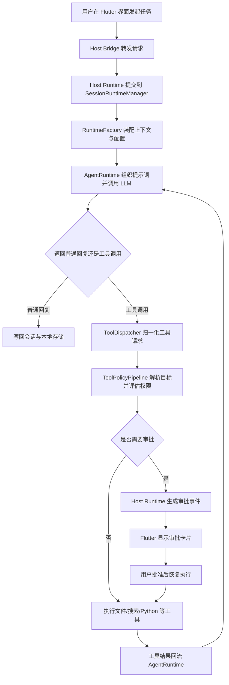
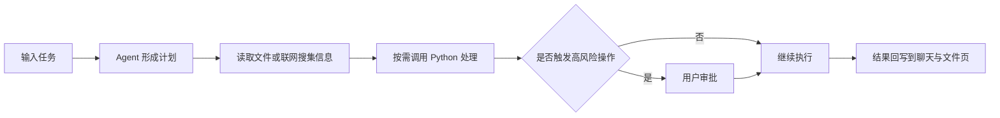

# 中国大学生计算机设计大赛软件开发类作品文档

作品名称：OpenCray 个性化协作型手机端私人助理

## 第一章需求分析

现有智能助手已经能完成问答、创作和资料整理，但在手机端，本地文件处理、权限审批、工具调用和长期个性化协作往往还是分开的。普通用户容易卡在复杂配置上，专业用户又缺少足够的控制权和扩展空间。OpenCray 因此定位为越用越懂用户的手机端私人助理。作品面向普通用户和专业用户，支持会话式任务发起、手机本地文件处理、联网搜索、受控 Python 执行，以及记忆系统和协作风格系统。性能目标是让主要流程在 Android 端独立完成，权限默认保守，状态本地保存，任务在审批后可以继续推进。

| 维度 | 豆包 | Kimi | OpenCray |
| --- | --- | --- | --- |
| 产品形态 | 通用智能助手 | 通用 AI 助手，长文本解析与深度研究能力较强 | 手机端私人助理 |
| 手机本地文件处理 | 以平台内上传与交互为主 | 以对话、资料解析和研究入口为主 | 内置工作区浏览、预览、编辑、分享 |
| 权限控制 | 平台预设能力为主 | 平台预设能力为主 | 三档自动化模式 + 路径与工具细粒度配置 |
| 个性化协作 | 通用助手体验 | 偏任务导向 | 记忆系统与协作风格系统联动 |
| 能力上限 | 平台功能组合 | 资料整理链路较强 | 可串联文件、联网搜索、Python 与技能扩展 |

## 第二章概要设计

第二章重点描述程序运行时的模块关系。页面只是入口，真正的执行主线在宿主桥接、会话运行时、智能体执行引擎、工具调度与本地存储之间。

### 2.1 运行时总体架构

如图 1 所示，程序运行时并不是按页面独立执行，而是从 Flutter 界面进入宿主桥接，再进入会话运行管理、任务运行时工厂、Agent 执行引擎，最后连接到 LLM、工具调度、权限策略和本地持久化。

图 1 OpenCray 运行时总体架构

### 2.2 任务执行链路

### 2.3 模块职责

| 模块 | 主要职责 | 说明 |
| --- | --- | --- |
| Flutter 界面层 | 展示会话、文件、设置与审批界面 | 负责交互，不直接承担智能体执行 |
| Host Bridge | 在 Flutter 与 Android 宿主之间转发方法调用和事件流 | 对接聊天、文件、设置等网关 |
| Host Runtime | 统一管理本地宿主能力、会话状态和运行结果投影 | 是前端侧看到的运行核心 |
| SessionRuntimeManager | 负责会话级任务提交、排队、恢复和取消 | 管理每个会话的执行生命周期 |
| AppAgentSessionTaskRuntimeFactory | 按任务装配 LLM、上下文、工具、权限和持久化依赖 | 决定每轮执行使用哪些运行资源 |
| OpenCrayAgentRuntime | 驱动 LLM 推理循环、工具调用循环和结果生成 | 负责计划推进与轮次控制 |
| OpenCrayToolDispatcher + ToolPolicyPipeline | 统一处理工具归一化、目标解析、权限判断和实际执行 | 保证不同工具共用同一套安全管线 |
| 本地持久化与个性化存储 | 保存会话、检查点、记忆、协作风格和运行记录 | 支撑恢复能力与长期个性化协作 |

## 第三章详细设计

### 3.1 界面设计

本作品的人机界面围绕“任务发起、过程可见、结果可回看”设计，重点页面如下。

| 页面 | 主要内容 | 典型操作 |
| --- | --- | --- |
| Chat | 消息流、待办面板、审批卡片、运行结果 | 提任务、查看计划、审批、继续执行 |
| Files | 目录浏览、文本预览、Markdown 预览、图片预览、编辑器 | 浏览文件、改写文本、整理结果、分享文件 |
| Settings | 安全限制、联网搜索、工作区访问、个性化配置 | 选择权限档位、授权公共路径、配置搜索与记忆 |

典型使用流程如下。

### 3.2 本地存储设计

本作品没有使用关系数据库。主要数据以会话快照、配置项和记忆记录为主，结构更接近文档型状态，且需要便于移动端恢复，因此采用本地文件与偏好存储。

| 数据对象 | 存储方式 | 典型文件或位置 | 说明 |
| --- | --- | --- | --- |
| 会话、消息、任务快照 | JSON 文件化存储 | 本地会话状态目录 | 便于应用重启后恢复 |
| 安全设置与搜索配置 | 系统偏好存储 | 对应设置存储项 | 读写频繁，结构较轻 |
| 记忆系统数据 | JSON 文件 | `memory.json` | 保存用户偏好、工作区事实等 |
| 协作风格配置 | Markdown 文件 | `SOUL.md` | 保存基础协作风格配置 |

采用这一方案的原因很直接：移动端强调轻量、可恢复和可迁移，本地文件与偏好存储更适合当前数据形态。

### 3.3 关键技术与特点

1. 权限模型采用“默认保守，逐步放开”的思路。系统提供安全、自动、开发三档自动化模式，同时允许对文件修改、文件删除、Shell 命令等高风险动作做细粒度覆盖。公共路径访问也不是默认全开，照片、下载、文档、录音等目录需要单独授权。这样既能保证安全边界，也保留了用户主权。

2. 个性化协作机制由记忆系统和协作风格系统共同组成。记忆系统把信息区分为用户偏好、项目事实、持续性指令和任务承诺，并按用户、工作区、会话三层保存；协作风格系统再把这些偏好叠加到称呼、语气、详细程度等交互细节中。长期使用后，系统不必每次重新设定，协作成本会下降。

3. 任务执行不是单轮回复，而是“计划 - 执行 - 审批 - 继续执行”的链路。运行时会维护待办状态，聊天页直接展示 TODO、审批卡片和继续执行入口。用户看到的是一条连贯流程，内部则是分阶段推进，这样更适合资料整理、文件处理等持续任务。

4. 文件、联网搜索和 Python 可以串成同一条任务链。Agent 已支持专用的 Python 执行工具 `python_exec`，Python 脚本在受控工作区内执行，环境和依赖由工作区侧管理；联网搜索能力也可以通过设置页接入。对于资料搜集、内容整理、表格与文档处理等任务，这种链路比单纯对话更实用。这里的结果以工作区产物形式回收，不依赖固定的单一导出按钮。

## 第四章测试报告

### 4.1 主要测试结果

| 测试项 | 方法 | 结果 |
| --- | --- | --- |
| Flutter 静态分析 | `dart analyze flutter_app` | 无 error、warning；1 条 info 级提醒 |
| Flutter 组件与交互测试 | `flutter test` | 243 项全部通过 |
| Kotlin 核心模块单元测试 | `:core :filesystem :llm :mcp :persistence :policy :runtime :skills` | `BUILD SUCCESSFUL` |
| Python 集成测试 | `python -m pytest python_tests` | 已建立 41 条用例；当前 Windows 评测环境存在临时目录清理噪声，未纳入最终通过率统计 |

Flutter 测试覆盖聊天菜单、文件浏览、Markdown 预览、设置保存等主流程。作品当前以 Flutter 与 Kotlin 测试结果作为主要质量依据。

### 4.2 技术指标

| 指标 | 表现 |
| --- | --- |
| 运行速度 | 首屏和主要页面优先使用本地快照加载，常用设置采用本地偏好存储，减少重复初始化 |
| 安全性 | 高风险操作统一走权限策略管线，支持路径授权、只读范围和审批流程 |
| 扩展性 | 运行时、策略、持久化、界面层分离，便于继续接入新工具与新场景 |
| 部署方便性 | Android 单机部署，无需单独数据库服务，可直接构建 APK 安装 |
| 可用性 | 任务发起、审批、文件查看和结果回收均可在手机端完成，路径较短 |

## 第五章安装及使用

### 5.1 安装环境

| 项目 | 要求 |
| --- | --- |
| 运行设备 | Android 8.0 及以上，推荐 Android 12 及以上 |
| 网络 | 首次配置模型或联网搜索时需要网络 |
| 主要权限 | 网络、通知、工作区目录访问；如需处理手机文件，还需在设置中授权公共路径 |
| 开发构建环境 | JDK 11、Android SDK、Flutter SDK |

### 5.2 默认安装过程

1. 在项目根目录执行 `build-apk.ps1 -Variant debug`，或使用 Gradle / Flutter 完成构建。
2. 将生成的 APK 安装到 Android 设备。
3. 首次启动后，根据提示完成模型、工作区和基础安全设置。
4. 如需处理手机内的照片、下载、文档等内容，在设置页授予对应公共路径权限。

### 5.3 典型使用流程

1. 进入 `Settings`，配置模型、工作区、联网搜索和权限档位。
2. 在 `Chat` 中输入任务，例如搜集资料、整理内容、处理文件或撰写文档。
3. 运行过程中如果触发高风险操作，系统会弹出审批卡片，由用户决定是否继续。
4. 任务结果可直接回写到聊天记录，也可在 `Files` 中查看、编辑、分享相关文件。

## 第六章项目总结

本项目最难的部分，不是单个页面或单个工具，而是把手机端私人助理做成一套既容易上手、又能逐步放开能力的系统。开发过程中，我们把用户主权放进权限模型，把长期使用价值放进记忆系统和协作风格系统，再用计划、执行、审批、继续执行的链路把复杂任务串起来。这样普通用户不需要理解底层机制也能开始使用，专业用户又能在明确授权后获得更高的操作上限。

后续升级仍会围绕手机端闭环继续推进，重点包括补强 Python 任务链稳定性、完善文档处理场景、优化记忆管理的可见性，以及扩展更多实用技能，而不是单纯增加概念性功能。

## 参考文献

[1] 中国大学生计算机设计大赛组委会. 中国大学生计算机设计大赛[EB/OL]. https://jsjds.blcu.edu.cn/, 2026-03-28.  
[2] 中国大学生计算机设计大赛组委会. 软件应用与开发类作品提交要求及文档模板（2023版）[EB/OL]. https://jsjds.blcu.edu.cn/info/1045/1785.htm, 2026-03-28.  
[3] Flutter Team. Add Flutter to an existing app[EB/OL]. https://docs.flutter.dev/add-to-app, 2026-03-28.  
[4] Android Developers. Task scheduling | Background work[EB/OL]. https://developer.android.com/develop/background-work/background-tasks/persistent, 2026-03-28.  
[5] Android Developers. Foreground services overview[EB/OL]. https://developer.android.com/develop/background-work/services/fgs, 2026-03-28.  
[6] 豆包. 豆包功能介绍[EB/OL]. https://www.doubao.com/legal/feature_intro, 2026-03-28.  
[7] Kimi. Kimi 官方网站[EB/OL]. https://www.kimi.com/, 2026-03-28.  
