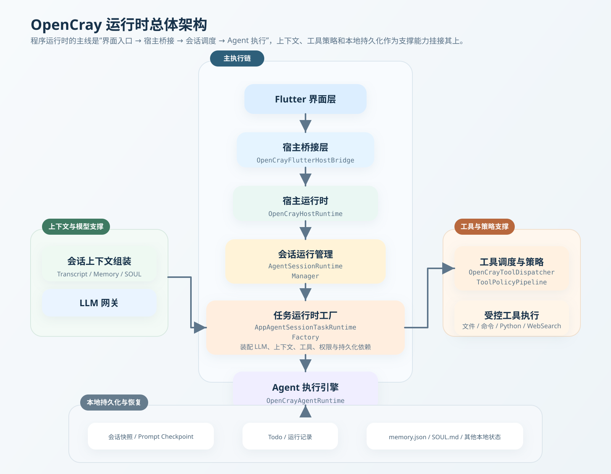
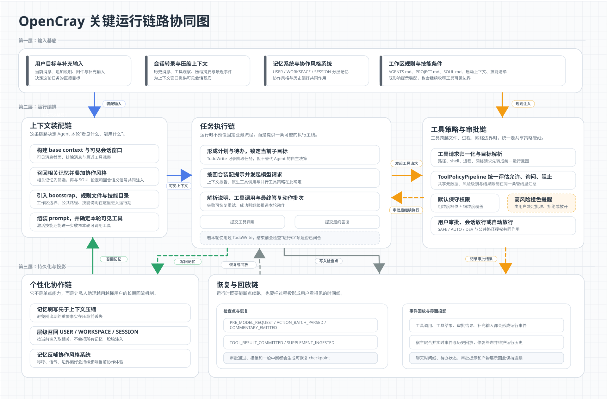

# 中国大学生计算机设计大赛软件开发类作品文档

作品名称：OpenCray 个性化协作型手机端私人助理

## 第一章需求分析

现有智能助手已经能完成问答、创作和资料整理，但在手机端，本地文件处理、权限审批、工具调用和长期个性化协作往往还是分开的。普通用户容易卡在复杂配置上，专业用户又缺少足够的控制权和扩展空间。OpenCray 因此定位为越用越懂用户的手机端私人助理。作品面向普通用户和专业用户，支持会话式任务发起、手机本地文件处理、联网搜索、受控 Python 执行，以及记忆系统、协作风格系统和技能扩展机制。性能目标是让主要流程在 Android 端独立完成，权限默认保守，状态本地保存，任务在审批后可以继续推进。

| 维度 | 豆包 | Kimi | OpenCray |
| --- | --- | --- | --- |
| 产品形态 | 通用智能助手 | 通用 AI 助手，长文本解析与深度研究能力较强 | 手机端私人助理 |
| 手机本地文件处理 | 以平台内上传与交互为主 | 以对话、资料解析和研究入口为主 | 内置工作区浏览、预览、编辑、分享 |
| 权限控制 | 平台预设能力为主 | 平台预设能力为主 | 三档自动化模式 + 路径与工具细粒度配置 |
| 个性化协作 | 通用助手体验 | 偏任务导向 | 记忆系统与协作风格系统联动 |
| 能力上限 | 平台功能组合 | 资料整理链路较强 | 可串联文件、联网搜索、Python 与技能扩展 |

## 第二章概要设计

第二章重点说明系统的总体分层、模块关系和主要入口，不展开具体实现细节。页面只是入口，核心运行由宿主层、会话层、智能体执行层、工具策略层和本地存储层共同完成。

### 2.1 运行时总体架构

如图 1 所示，程序运行时并不是按页面独立执行，而是从 Flutter 界面进入宿主桥接，再进入会话运行管理、任务运行时工厂、Agent 执行引擎，最后连接到 LLM、工具调度、权限策略和本地持久化。

图 1 OpenCray 运行时总体架构

### 2.2 模块层次与调用关系

| 层次 | 主要模块 | 主要作用 | 调用关系 |
| --- | --- | --- | --- |
| 界面入口层 | 对话、文件、技能、设置界面 | 接收用户输入、展示审批和结果，并提供能力扩展入口 | 通过宿主桥接访问本地运行能力 |
| 宿主与会话层 | 宿主运行时、会话运行管理 | 统一管理任务提交、恢复、取消和结果投影 | 向上连接界面，向下调度智能体执行 |
| 智能体执行层 | 任务运行时工厂、Agent 执行引擎 | 组装上下文、驱动模型推理和任务推进 | 调用模型、工具和本地存储 |
| 工具策略层 | 工具调度、权限策略、工具执行 | 统一处理文件、搜索、Python 等能力及审批 | 为智能体执行层提供受控工具能力 |
| 本地存储层 | 会话快照、记忆、协作风格、本地设置 | 保存状态并支持恢复 | 为宿主层和执行层提供持久化支撑 |

系统运行时遵循“界面发起任务，宿主层接收并分发，会话层组织执行，智能体层调用模型与工具，本地存储层负责落盘和恢复”的基本关系。

### 2.3 人机界面与主要入口

| 入口 | 对应模块 | 作用 |
| --- | --- | --- |
| 对话界面 | 会话入口 | 发起任务、查看计划、处理审批、接收结果 |
| 文件界面 | 文件入口 | 浏览、预览、编辑和回收任务产物 |
| 技能界面 | 扩展入口 | 管理工作区技能、按来源安装、按工作区启停或更新 |
| 设置界面 | 配置入口 | 调整模型、联网搜索、工作区访问和安全策略 |

这几个入口分别承担“发起任务”“处理结果”“扩展能力”“调整边界”的职责。其中 `技能` 入口负责管理工作区技能集；安装或启停后，相关能力会回到主执行链中按需被调用。

## 第三章详细设计

### 3.1 界面设计

本作品的人机界面围绕“任务发起、过程可见、结果可回看”设计。`技能` 页不是附属页面，而是私人助理的能力扩展入口；用户既可以直接使用默认能力，也可以按需要安装、启停和更新技能。重点页面如下。

| 页面 | 主要内容 | 典型操作 |
| --- | --- | --- |
| 对话页面 | 消息流、待办面板、审批卡片、运行结果 | 提任务、查看计划、审批、继续执行 |
| 文件页面 | 目录浏览、文本预览、Markdown 预览、图片预览、编辑器 | 浏览文件、改写文本、整理结果、分享文件 |
| 技能页面 | 管理页、安装页、已装技能、安装来源、技能说明 | 搜索、安装、启停、预览说明、检查更新 |
| 设置页面 | 安全限制、联网搜索、工作区访问、个性化配置 | 选择权限档位、授权公共路径、配置搜索与记忆 |

四个页面形成“任务发起 - 结果落地 - 能力扩展 - 环境配置”的闭环。其中对话页面负责任务推进，文件页面负责查看和整理产物，技能页面负责扩展能力边界，设置页面负责管理权限、搜索和个性化参数。

### 3.2 本地存储设计

本作品没有使用关系数据库。主要数据以会话快照、配置项和记忆记录为主，结构更接近文档型状态，且需要便于移动端恢复，因此采用本地文件与偏好存储。

| 数据对象 | 存储方式 | 典型文件或位置 | 说明 |
| --- | --- | --- | --- |
| 会话、消息、任务快照 | JSON 文件化存储 | 本地会话状态目录 | 便于应用重启后恢复 |
| 安全设置与搜索配置 | 系统偏好存储 | 对应设置存储项 | 读写频繁，结构较轻 |
| 记忆系统数据 | JSON 文件 | `memory.json` | 保存用户偏好、工作区事实等 |
| 协作风格配置 | Markdown 文件 | `SOUL.md` | 保存基础协作风格配置 |

采用这一方案的原因很直接：移动端强调轻量、可恢复和可迁移，本地文件与偏好存储更适合当前数据形态。

### 3.3 关键技术与特点

1. 权限模型采用“默认保守，逐步放开”的思路。系统提供安全、自动、开发三档自动化模式，同时允许对文件修改、文件删除、Shell 命令等高风险动作做细粒度覆盖；照片、下载、文档、录音等公共路径也需要单独授权。这一设计既保留安全边界，也保留用户主权。

2. 个性化协作机制由记忆系统和协作风格系统共同组成。记忆系统按用户、工作区、会话三层保存偏好与事实，协作风格系统再把这些信息落实到称呼、语气、详细程度等交互细节中。长期使用后，用户不必反复重新设定协作方式。

3. 任务执行不是单轮回复，而是“计划 - 执行 - 审批 - 继续执行”的链路。运行时会维护待办状态，聊天页直接展示待办、审批卡片和继续执行入口，使资料整理、文件处理等持续任务可以在手机端连贯推进。

4. 文件、联网搜索和 Python 可以串成同一条任务链。Agent 已支持专用的 Python 执行工具 `python_exec`，脚本在受控工作区内执行；联网搜索能力则通过设置页配置搜索服务提供方接入。任务结果统一回收到聊天记录或工作区产物，不依赖固定的单一导出按钮。

5. 技能扩展采用工作区技能集管理方式。用户可以在 `技能` 页查看、安装、启停和更新技能，运行时再把当前可见技能集带入会话上下文，由 Agent 在任务中按需使用。这样能力边界不会被首发版本写死。

### 3.4 关键运行链路设计

前两节说明了页面与存储，本节进一步说明运行时如何把任务真正跑完。图 2 所示的几条链路并不是孤立存在，而是围绕任务执行链持续协作。

图 2 OpenCray 关键运行链路协作关系

图中上方单独标出的“技能扩展链”不是另一条并行主流程，而是通过可见技能注入和工具限制，分别作用于上下文装配链与任务执行链，因此下文不再单列展开。

| 链路 | 主要阶段 | 运行时支持与特点 | 结果回收 |
| --- | --- | --- | --- |
| 任务执行链 | 输入任务 → 形成计划 → 按需调用搜索、文件、Python 等能力 → 审批或继续 → 输出结果 | 这是主链路。运行时负责提供工具、待办状态和产物回收机制，具体顺序由 Agent 自行组织，不写死为固定工作流 | 聊天结果、运行记录、待办状态、工作区产物 |
| 上下文装配链 | 会话转录 → 记忆刷新 → 历史压缩 → 工作区引导信息注入 → 组装本轮上下文 | 决定 Agent 每轮能看到哪些历史、偏好、技能与环境信息，也是移动端控制上下文体积的关键 | 本轮上下文、压缩结果、装配痕迹 |
| 个性化协作链 | 读取会话事实、工作区记忆、用户偏好与协作风格 → 参与本轮生成 → 必要信息写回本地存储 | 这一链路不追求把所有内容都自动记住，而是让偏好、持续性指令和重要事实逐步沉淀，减少重复沟通 | 更稳定的称呼、语气、详细程度和任务连续性 |
| 权限审批链 | 工具请求归一化 → 策略评估 → 用户审批或直接执行 → 返回执行状态 | 高风险工具和敏感路径默认不会直接放开。用户既可以按三档模式粗调，也可以对路径和工具单独细调 | 审批结果、执行结果、可恢复运行状态 |
| 恢复与回放链 | 关键边界写入检查点 → 审批或异常暂停 → 从断点恢复 → 运行事件回放 | 这条链路保证任务不会因为审批、重试耗尽或页面切换就完全丢失，也支撑聊天页的过程可见 | 恢复后的运行状态、可回看的过程时间线 |

#### 3.4.1 任务执行链

1. 用户在对话界面中输入任务后，系统先整理当前目标、上下文和可用能力，形成可继续推进的步骤。简单任务可能一轮完成，复杂任务则会拆成若干阶段；如果进入计划态，相关待办会同步投影到聊天页。
2. 执行阶段会在“普通回复”和“工具调用”之间切换。如果任务需要搜索、读取文件、整理资料或调用 Python，Agent 会根据实际情况自行组织顺序，运行时只负责提供能力和状态支撑；若当前激活了技能，本轮可调用工具还会进一步收窄。对个别复杂步骤，系统也可以只把局部问题拆成子任务补充处理，再把摘要回收给主流程。
3. 一旦碰到高风险动作，当前步骤会暂停，界面生成审批卡片。用户批准后，运行时从断点继续；拒绝后则终止当前分支并保留记录。最终结果既可以回到聊天页，也可以落成工作区文件；如果前面已经进入待办计划态，结束前还会检查进行中的待办是否已经收口。

#### 3.4.2 上下文装配链

1. 每轮正式请求模型前，系统会先准备会话上下文，而不是简单把整段历史原样拼接进去。当前会话转录、用户输入、工作区环境和可用能力，会先整理成基础上下文。
2. 对普通对话任务，运行时会先尝试把适合沉淀的内容写入记忆，再根据需要做历史压缩，避免上下文在长期使用后不断膨胀，从而兼顾连续性和移动端负担。
3. 在此基础上，系统再按当前模式决定是否注入工作区引导信息、召回相关记忆、带入可见技能清单，并完成本轮提示词组装。装配结束后，运行时还会记录历史裁剪、记忆召回和压缩情况，为后续恢复、回放和调试提供依据。

#### 3.4.3 个性化协作链

1. 这条链路的重点不在“怎样装配上下文”，而在“哪些信息会长期影响协作”。系统会综合会话事实、工作区记忆、用户偏好，以及 `SOUL.md` 中的协作风格配置，决定当前回答该怎么说、说到什么深度、哪些约束需要优先遵守。
2. 记忆系统按用户、工作区、会话三层保存信息，用户偏好、项目事实、持续性指令和任务承诺不会混成一层；协作风格系统再把这些信息落实到称呼方式、语气松紧、说明详细程度，以及是否倾向先列计划再执行等交互细节里。
3. 本轮结束后，只有有持续价值的内容才会沉淀到本地存储。无关紧要的信息不必长期保留；如果用户不希望某些内容继续保留，也可以手动删除或要求 Agent 删除。

#### 3.4.4 权限审批链

1. 运行时发起工具调用后，请求会先被统一归一化，再进入策略判断。真正决定“能不能执行”的不是界面按钮，而是同一套权限策略链路。
2. 策略判断同时参考三档自动化模式和细粒度规则。前者负责整体保守程度，后者负责把某类工具或某个公共路径设成允许、询问或阻止；如果动作涉及文件修改、删除、命令执行或敏感路径访问，系统会优先进入审批态，高风险项则会用更醒目的方式提醒用户。
3. 这条链路的重点不是单纯“拦住风险”，而是在安全和效率之间留出可调空间。普通用户可以维持保守配置，专业用户也可以在充分理解后主动放宽限制，减少任务中断。

#### 3.4.5 恢复与回放链

1. 运行时不会只在任务结束时保存状态，而是在模型请求前、动作批解析后、工具结果提交后、补充信息写入后等关键边界生成检查点。这样真正需要恢复时，系统手里是有断点的。
2. 如果执行过程中进入审批等待，或者模型重试耗尽、任务暂时无法继续，宿主层会把当时的恢复状态连同相关元数据一起保存；当用户批准、拒绝、补充新输入或手动继续执行后，运行时可以直接从断点恢复，而不是重新从第一步开始。
3. 与此同时，工具调用、工具结果、阶段性回复、补充输入等运行事件会被写入可回放记录。聊天页看到的过程，不只是界面临时拼出来的，而是由实时事件和持久化回放共同组成。

## 第四章主要测试与技术指标

### 4.1 主要测试过程、结果及修正

| 测试项 | 测试过程与关注点 | 结果 | 修正或结论 |
| --- | --- | --- | --- |
| Flutter 静态分析 | 执行 `dart analyze flutter_app`，检查 Flutter 页面、状态同步和路由层是否存在明显静态问题 | 本轮未发现 error，发现 1 条 warning | warning 位于测试代码的未使用参数，不影响运行，但在提交前仍应清理 |
| Flutter 组件与交互测试 | 执行 `flutter test`，覆盖聊天、文件浏览、Markdown 预览、设置保存、技能管理等主要交互链路 | 246 项全部通过 | 说明手机端主交互在当前版本下保持稳定 |
| 本地运行时性能烟测 | 执行 `RuntimePerformanceSmokeTest`，对记忆检索和上下文装配做 240 次重复测量 | `memory_retrieve` 平均 `0.532 ms`、P95 `0.869 ms`；`context_prepare` 平均 `0.072 ms`、P95 `0.145 ms` | 说明本地轻量运行时链路基本处于毫秒级，可支撑手机端高频交互 |
| Kotlin 运行时与宿主层回归补测 | 执行 `./gradlew.bat :runtime:testDebugUnitTest :app:testDebugUnitTest`，补查运行时与宿主层回归 | `runtime` 495 项中 1 项失败；`app` 687 项中 32 项失败 | 失败主要集中在技能接线、恢复检查点、跨会话记忆和运行时服务自举等既有基线问题，本轮已被补测暴露，需继续清理 |
| Android 嵌入式 Python 真机联调 | 在真机环境下检查请求文件、结果文件、日志文件、服务就绪标记和进程退出行为，验证手机端 Python 闭环是否真实可用 | 已完成成功闭环验证：脚本可执行、结果文件可生成、退出阶段不再出现上一轮 native crash 特征 | 调试中先后定位出“`_python_bundle` 未完整解包”和“one-shot 退出路径触发崩溃”两层根因，最终通过宿主侧提取修复、自愈修复以及 persistent service 方案解决 |
| Python 集成测试 | 执行 `python -m pytest python_tests`，验证工作区 Python 工具链和脚本执行相关逻辑 | 41 条用例中 25 条通过，16 条因当前 Windows/沙箱目录权限报错未完成 | 该组测试已证明桥接脚本和部分适配层可回归，但要得到完整结果仍需在更干净的本地 Python 环境下复测 |

### 4.2 技术指标

| 指标 | 表现 |
| --- | --- |
| 运行速度 | 本地性能烟测显示：240 条记忆记录下的记忆检索平均 `0.532 ms`、P95 `0.869 ms`；10 条对话消息参与的上下文装配平均 `0.072 ms`、P95 `0.145 ms`；2026 年 3 月 29 日真机验证中，嵌入式 Python 服务从启动到结果落盘约 `1` 秒 |
| 安全性 | 文件、命令、联网与 Python 等高风险能力受权限策略约束，支持三档自动化模式、公共路径授权和审批流程 |
| 扩展性 | 运行时、策略、持久化、界面和技能管理分层实现，可继续接入新工具、新技能和新任务场景 |
| 部署方便性 | Android 单机部署，无需额外数据库服务；可直接构建 APK 安装，主要状态保存在本地 |
| 可用性 | 任务发起、审批、文件查看、结果回收和继续执行均可在手机端完成，复杂任务不必切回桌面端处理 |

## 第五章安装及使用

### 5.1 安装环境

| 项目 | 要求 |
| --- | --- |
| 运行设备 | Android 8.0 及以上，推荐 Android 12 及以上 |
| 网络 | 首次配置模型或联网搜索时需要网络 |
| 主要权限 | 网络、通知、工作区目录访问；如需处理手机文件，还需在设置中授权公共路径 |
| 开发构建环境 | JDK 11、Android SDK、Flutter SDK |

### 5.2 默认安装过程

1. 在项目根目录执行 `build-apk.ps1 -Variant debug`，或使用 Gradle / Flutter 完成构建。
2. 将生成的 APK 安装到 Android 设备。
3. 首次启动后，根据提示完成模型、工作区和基础安全设置。
4. 如需处理手机内的照片、下载、文档等内容，在设置页授予对应公共路径权限。

### 5.3 典型使用流程

1. 进入 `Settings`，配置模型、工作区、联网搜索和权限档位。
2. 在 `Chat` 中输入任务，例如搜集资料、整理内容、处理文件或撰写文档。
3. 运行过程中如果触发高风险操作，系统会弹出审批卡片，由用户决定是否继续。
4. 任务结果可直接回写到聊天记录，也可在文件界面中查看、编辑、分享相关文件。

## 第六章项目总结

本项目最难的部分，不是单个页面或单个工具，而是把手机端私人助理做成一套既容易上手、又能逐步放开能力的系统。开发过程中，我们把用户主权放进权限模型，把长期使用价值放进记忆系统和协作风格系统，再用计划、执行、审批、继续执行的链路把复杂任务串起来。这样普通用户不需要理解底层机制也能开始使用，专业用户又能在明确授权后获得更高的操作上限。

其中，Android 端嵌入式 Python 运行时的修复，是开发过程中最反复、也最能暴露系统难点的一次排障。最初表面现象只是启动超时，看起来像是脚本根本没有运行；但我们在真机上反复比对请求文件、结果文件、日志文件、服务就绪标记和宿主打包行为后，才确认这并不是单一故障，而是两层根因串联。第一层根因是宿主 APK 没有按运行时预期把 `libpybundle.so` 正确落到磁盘，导致 `_python_bundle` 无法完整解包，服务还没进入稳定轮询就已经失败；第二层根因则是在前一层修复后，脚本虽然已经执行成功，但 one-shot 退出路径又在当前 Android 环境下触发了 native 崩溃。这个问题不是一次改配置就结束的，我们经历了多轮“看起来修好了、实际上还有下一层问题”的反复调试，最终才把根因真正挖出来。

最后的解决方式也不是单点修补，而是同时处理宿主侧和运行时侧：一方面补齐 native lib 提取配置，并加入对残缺 payload 的自愈修复；另一方面把 Python service 从一次性退出改成常驻轮询，在结果落盘后再由宿主主动停止。做到这一步后，Python 链路才从“能偶尔跑起来”变成“能稳定地集成进手机端任务闭环”。这次修复也让我们更明确了一点：手机端私人助理最难的不是把功能堆出来，而是把文件、权限、运行时和恢复机制一起做稳。

后续升级仍会围绕手机端闭环继续推进，重点包括补强 Python 任务链稳定性、完善文档处理场景、优化记忆管理的可见性，以及扩展更多实用技能，而不是单纯增加概念性功能。

## 参考文献

[1] 中国大学生计算机设计大赛组委会. 中国大学生计算机设计大赛[EB/OL]. https://jsjds.blcu.edu.cn/, 2026-03-28.  
[2] 中国大学生计算机设计大赛组委会. 软件应用与开发类作品提交要求及文档模板（2023版）[EB/OL]. https://jsjds.blcu.edu.cn/info/1045/1785.htm, 2026-03-28.  
[3] Flutter Team. Add Flutter to an existing app[EB/OL]. https://docs.flutter.dev/add-to-app, 2026-03-28.  
[4] Android Developers. Task scheduling | Background work[EB/OL]. https://developer.android.com/develop/background-work/background-tasks/persistent, 2026-03-28.  
[5] Android Developers. Foreground services overview[EB/OL]. https://developer.android.com/develop/background-work/services/fgs, 2026-03-28.  
[6] 豆包. 豆包功能介绍[EB/OL]. https://www.doubao.com/legal/feature_intro, 2026-03-28.  
[7] Kimi. Kimi 官方网站[EB/OL]. https://www.kimi.com/, 2026-03-28.  
